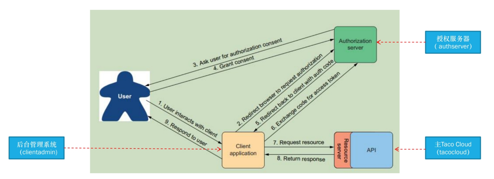

[toc]
# OAuth2
之前的方法一般用于单体应用程序的权限控制，那么对于分布式应用的权限控制呢？
我们希望把用户的认证和授权集中起来，然后让其他微服务专注于自己的业务处理，所以就有了OAuth2这样的安全规范。
1. 创建授权服务器
2. 创建资源服务器
3. 开发客户端应用
## 1.介绍
1. 复习
    - spring-boot-starter-security依赖
    - 基于http对象做权限定义
    - POST在一次认证后也会将SessionID保存在本地，类似浏览器，可以将Cookie删除
2. OAuth2是一个安全规范
授权码授权模式

    - 授权服务器
    - 资源服务器（实现Rest API）
    - 客户端（调用/消费API的程序）
    - 用户（使用客户端）
3. 请求头有一个属性叫authorization
4. 过程
    - 1. 用户使用客户端应用程序
    - 2. 客户端发现用户未登录无法使用API，**重定向**到授权服务器
    - 3. 授权服务器打开用户名对话框，索取用户名和密码
    - 4. 授权服务器提供授权界面，让用户为客户端提供一些权限
    - 5. 用户授权后，授权服务器为客户端返回授权码
    - 6. 客户端使用code向授权服务器交换一个token
    - 7. 客户端请求API时，头部会带上token（authorization属性）
    - 8. 资源服务器向授权服务器请求公钥，确认token的合法性，将资源返回客户端（token中带有授权服务器的私钥）
    - 9. 客户端将资源呈现给用户
5. 其他模式
    - 隐式授权（implicit grant），直接返回访问令牌（token），而不是授权码
    - 用户凭证（或密码）授权（user credentials (password) grant）：用户凭证直接换取访问令牌，不经过浏览器登录
    - 客户端凭证授权（client credentials grant）：客户端交换自己的凭证以获取访问令牌
## 2.创建授权服务器
1. 依赖
```xml
<dependency>
	<groupId>org.springframework.boot</groupId>
	<artifactId>spring-boot-starter-oauth2-authorization-server</artifactId>
</dependency>
```
2. 配置
```java
@Configuration(proxyBeanMethods = false)
public class AuthorizationServerConfig {

  @Bean
  @Order(Ordered.HIGHEST_PRECEDENCE)
  public SecurityFilterChain authorizationServerSecurityFilterChain(HttpSecurity http) throws Exception {
    OAuth2AuthorizationServerConfiguration
        .applyDefaultSecurity(http);
    return http
        .formLogin(Customizer.withDefaults())
        .build();
  }

  // @formatter:off
  // 定义客户端应用程序的信息
  @Bean
  public RegisteredClientRepository registeredClientRepository(
          PasswordEncoder passwordEncoder) {
    RegisteredClient registeredClient =
      RegisteredClient.withId(UUID.randomUUID().toString())
        .clientId("taco-admin-client") // 客户端Id
        .clientSecret(passwordEncoder.encode("secret"))
        .clientAuthenticationMethod(
                ClientAuthenticationMethod.BASIC) // 客户端向授权服务器的访问方式
        .authorizationGrantType(AuthorizationGrantType.AUTHORIZATION_CODE) // 授权模式
        .authorizationGrantType(AuthorizationGrantType.REFRESH_TOKEN)
        .redirectUri(
            "http://clientadmin:9090/login/oauth2/code/taco-admin-client")//用于验证的，客户端会传相同的重定向地址过来，这个地址用于客户端登录
            // 用户认证授权之后，授权服务器需要告诉浏览器将请求重定向到哪里，即客户端地址
        .scope("writeIngredients") // 向用户开放的权限
        .scope("deleteIngredients")
        .scope(OidcScopes.OPENID)
        .clientSettings(
            clientSettings -> clientSettings.requireUserConsent(true)) // 要不要展示授权的对话框
        .build();
    return new InMemoryRegisteredClientRepository(registeredClient);
  }
  // @formatter:on

  // 指定授权服务器的地址
  @Bean
  public ProviderSettings providerSettings() {
    return new ProviderSettings().issuer("http://authserver:9000");
  }
  
  // 创建一对公钥私钥
  @Bean
  public JWKSource<SecurityContext> jwkSource()
		  throws NoSuchAlgorithmException {
    RSAKey rsaKey = generateRsa();
    JWKSet jwkSet = new JWKSet(rsaKey);
    return (jwkSelector, securityContext) -> jwkSelector.select(jwkSet);
  }
  
  private static RSAKey generateRsa() throws NoSuchAlgorithmException {
    KeyPair keyPair = generateRsaKey();
    RSAPublicKey publicKey = (RSAPublicKey) keyPair.getPublic();
    RSAPrivateKey privateKey = (RSAPrivateKey) keyPair.getPrivate();
    return new RSAKey.Builder(publicKey)
        .privateKey(privateKey)
        .keyID(UUID.randomUUID().toString())
        .build();
  }
  // 生成key的方法
  private static KeyPair generateRsaKey() throws NoSuchAlgorithmException {
	  KeyPairGenerator keyPairGenerator = KeyPairGenerator.getInstance("RSA");
	  keyPairGenerator.initialize(2048);
	  return keyPairGenerator.generateKeyPair();
  }

  @Bean
  public JwtDecoder jwtDecoder(JWKSource<SecurityContext> jwkSource) {
    return OAuth2AuthorizationServerConfiguration.jwtDecoder(jwkSource);
  }

}
```
3. 存储用户信息
    - Spring Security的相关内容
4. 配置本地域名
5. 运行授权服务器
    - http://authserver:9000/oauth2/authorize?response_type=code&client_id=taco-admin-client&scope=writeIngredients+deleteIngredients&redirect_uri=http://clientadmin:9090/login/oauth2
    - 以上链接是客户端发现用户未登录，**重定向到授权服务器的地址**
    - 授权类型为code模式，然后是客户端id和权限，以及重定向到客户端的地址（会接受code）
    - 浏览器拿着返回的code，转到客户端，将code带给客户端
    - 然后客户端会拿着code向授权服务器交换token（带上**客户端的id和密码**）
6. **为什么要先拿到code，然后通过code去交换token？**
    - 资源服务器要验证客户端的id和密码才能给token，只要code而没有密码是无法拿到token的
    - 避免泄露**客户端的密码**
## 3.创建资源服务器
1. 依赖
```xml
<dependency>
    <groupId>org.springframework.boot</groupId>
    <artifactId>spring-boot-starter-oauth2-resource-server</artifactId>
</dependency>
```
1. 权限相关代码
```java
.antMatchers(HttpMethod.POST, "/api/ingredients")
    .hasAuthority("SCOPE_writeIngredients")
.antMatchers(HttpMethod.DELETE, "/api/ingredients/*")
    .hasAuthority("SCOPE_deleteIngredients")
// SCOPE前缀意味着来自OAuth2权限的授权

// 开启调用API前的过滤器：
// 指出我要抓取authorization的属性，确认token合法性等动作
.and()
    .oauth2ResourceServer(oauth2 -> oauth2.jwt())
``` 
3. 配置资源服务器从何处获取公钥
```yml
spring:
  security:
    oauth2:
      resourceserver:
        jwt:
          jwk-set-uri: http://authserver:9000/oauth2/jwks
```
## 4.开发客户端应用
见代码的tacocloud-client部分，它是一个web app
1. 依赖
```xml
<dependency>
    <groupId>org.springframework.boot</groupId>
    <artifactId>spring-boot-starter-oauth2-client</artifactId>
</dependency>
```
2. 代码配置
```java
@Configuration
public class SecurityConfig {

  @Bean
  SecurityFilterChain defaultSecurityFilterChain(HttpSecurity http) throws Exception {
    http
      .authorizeRequests(
          authorizeRequests -> authorizeRequests.anyRequest().authenticated()
      )
      .oauth2Login(
        oauth2Login ->
        oauth2Login.loginPage("/oauth2/authorization/taco-admin-client")) // 指的是当客户端需要登录时要重定向的页面
      .oauth2Client(withDefaults());
    return http.build();
  }


  // 获得token，将token放在头部authorization属性等操作
  @Bean
  @RequestScope // 每次请求创建一个对象
  // 而控制器是每次会话唯一的，中间用了代理
  public IngredientService ingredientService(
                OAuth2AuthorizedClientService clientService) {
    Authentication authentication =
            SecurityContextHolder.getContext().getAuthentication();

    String accessToken = null;

    if (authentication.getClass()
              .isAssignableFrom(OAuth2AuthenticationToken.class)) {
      OAuth2AuthenticationToken oauthToken =
              (OAuth2AuthenticationToken) authentication;
      String clientRegistrationId =
              oauthToken.getAuthorizedClientRegistrationId();
      if (clientRegistrationId.equals("taco-admin-client")) {
        OAuth2AuthorizedClient client =
            clientService.loadAuthorizedClient(
                clientRegistrationId, oauthToken.getName());
        accessToken = client.getAccessToken().getTokenValue();
      }
    }
    // Rest template操作，可以看看这个代码实现
    return new RestIngredientService(accessToken);
  }

}
```
3. 属性配置
```yml
spring:
  security:
    oauth2:
      client:
        registration:
          taco-admin-client:
            provider: tacocloud
            client-id: taco-admin-client
            client-secret: secret # 索取token时用
            authorization-grant-type: authorization_code
            redirect-uri: "http://clientadmin:9090/login/oauth2/code/{registrationId}"
            scope: writeIngredients,deleteIngredients,openid 
        provider:
          tacocloud:
            issuer-uri: http://authserver:9000
```
## 5.流程
1. 访问http://clientadmin:9090，返回登录对话框
    - 首先重定向到http://clientadmin:9090/oauth2/authorization/taco-admin-client
    - 用户没有登录，重定向到http://authserver:9000/oauth2/authorize?response_type=code&client_id=taco-admin-client&scope=writeIngredients+deleteIngredients&redirect_uri=http://clientadmin:9090/login/oauth2
    - 授权服务发现用户未登录，重定向到http://authserver:9000/login
2. 登录后
    - 重定向到http://authserver:9000/oauth2/authorize?response_type=code&client_id=taco-admin-client&scope=writeIngredients+deleteIngredients&redirect_uri=http://clientadmin:9090/login/oauth2
    - 授权后，重定向到http://clientadmin:9090/login/oauth2/code/taco-admin-client?code=···（带有关键信息code）
    - 客户端向授权服务器索取token
    - 返回最初请求的页面http://clientadmin:9090

## 复习
1. 资源服务器在第一次拿到token时，要向授权服务器索取公钥，之后如果token没有变化，就不再索取
2. 授权服务器和客户端为什么要重复定义客户端的重定向地址
    - 授权服务器维护的重定向地址只是用来校验
