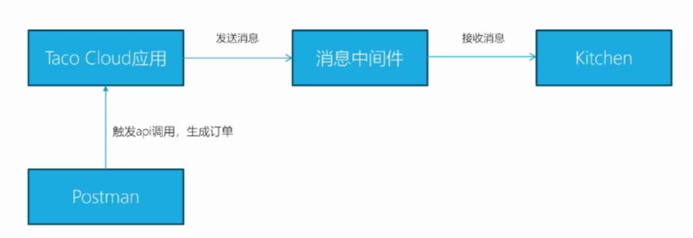
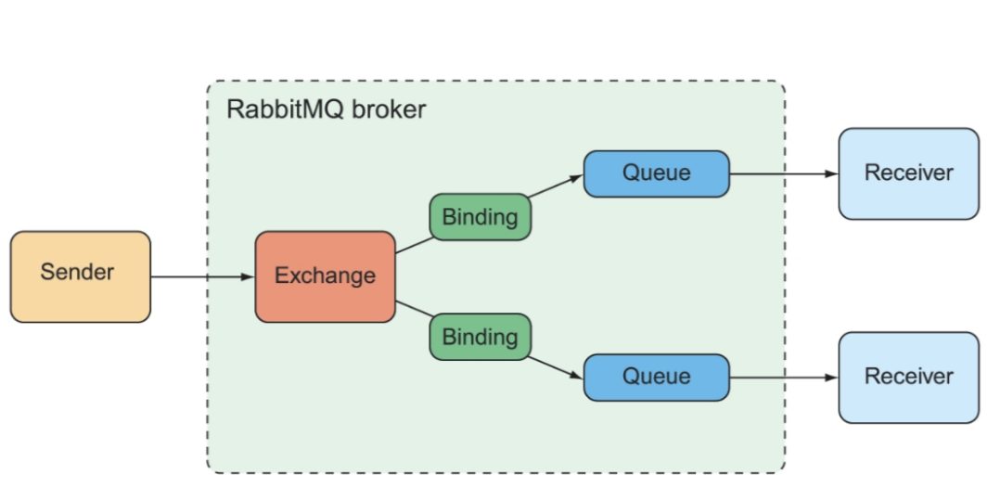

[toc]
# 消息中间件
## 1.同步与异步
1. 同步
    - A调用B，A获取到返回值后才执行下一步操作
2. 异步
    - A向B发送一个消息，然后继续执行，不用等B返回
3. broker

## 2.消息中间件
1. 消息中间件主要用于组件之间的**解耦**，消息的发送者无需知道消息使用者的存在，反之亦然
2. 常用的消息中间件有：ActiveMQ、RabbitMQ、kafka

## 3.JMS
1.  Java消息服务（Java Message Servcie）
2. JMS是一个**Java标准**，定义了使用消息代理（message broker）的通用API
3. Spring通过基于模板的抽象为JMS功能提供了支持，这个模板就是JmsTemplate
## 4.消息代理（broker）
### 4.1ActiveMQ Artemis
1. Apache ActiveMQ
2. Apache ActiveMQ Artemis，重新实现的下一代ActiveMQ
3. 链接
    - https://activemq.apache.org/components/artemis/
    - https://activemq.apache.org/components/artemis/download/
    - https://github.com/apache/activemq-artemis/blob/main/docs/user-manual/docker.adoc
      - docker部署
4. ActiveMQ Artemis 是一个优秀的跨平台、高性能、开源的消息代理系统
5. 支持的协议
    - JMS 协议
    - AMQP （Advanced Message Queueing Protocol）
    - MQTT（Message Queuing Telemetry Transport）
      - 轻量级协议，在内容上做了一些简化，底层基于tcp协议，并且使用了ssh
      - 适用于物联网的环境
6. Native 内存模式与 JVM 内存模式
7. 分布式架构
8. 消息持久化
    - 消息不会丢失
#### 4.1.1Docker运行
`docker run --detach --name mycontainer -p 61616:61616 -p 8161:8161 apache/activemq-artemis:latest-alpine`
管理控制台：http://localhost:8161 artemis/artemis

#### 4.1.2依赖
```xml
<dependency>
    <groupId>org.springframework.boot</groupId>
    <artifactId>spring-boot-starter-artemis</artifactId>
</dependency>
```
#### 4.1.3直接使用JMS接口发送与接收消息
1. 生产者
```java
public class ArtemisExampleSend {
    private static final String BROKER_URL = "tcp://localhost:61616";
    private static final String USERNAME = "artemis";
    private static final String PASSWORD = "artemis";

    public static void main(String[] args) throws JMSException {
        ConnectionFactory connectionFactory = new ActiveMQConnectionFactory(BROKER_URL, USERNAME, PASSWORD);
        // 创建连接
        Connection connection = connectionFactory.createConnection();
        connection.start();
        // 创建会话
        Session session = connection.createSession(false, Session.AUTO_ACKNOWLEDGE);
        // 创建队列（destination可以是队列，也可以是主题）
        Destination destination = session.createQueue("queue.example");

        MessageProducer messageProducer = session.createProducer(destination);
        TextMessage textMessage = session.createTextMessage();
        textMessage.setText("Hello, Artemis!");

        messageProducer.send(textMessage);
        System.out.println("Message sent successfully!");

        connection.close();
    }
}
```
2. 消费者
```java
public class ArtemisExampleReceive {
    private static final String BROKER_URL = "tcp://localhost:61616";
    private static final String USERNAME = "artemis";
    private static final String PASSWORD = "artemis";

    public static void main(String[] args) throws JMSException {
        ConnectionFactory connectionFactory = new ActiveMQConnectionFactory(BROKER_URL, USERNAME, PASSWORD);
        Connection connection = connectionFactory.createConnection();
        connection.start();

        Session session = connection.createSession(false, Session.AUTO_ACKNOWLEDGE);
        Destination destination = session.createQueue("queue.example");

        MessageConsumer messageConsumer = session.createConsumer(destination);
        Message message = messageConsumer.receive();

        if (message instanceof TextMessage) {
            System.out.println("Message received: " + ((TextMessage) message).getText());
        }

        connection.close();
    }
}
```
#### 4.1.4为taco-cloud加上JMS
1. 使用JmsTemplate（Spring对JMS集成支持的核心）
2. 发送的两个方法：send、convertAndSend
```java
@Service
public class JmsOrderMessagingService implements OrderMessagingService {

  private JmsTemplate jms;  // 上面的依赖提供的对象

  @Autowired
  public JmsOrderMessagingService(JmsTemplate jms) {
    this.jms = jms;
  }

  @Override
  public void sendOrder(TacoOrder order) {
    // 第一个参数是destination，第二个是消息对象，第三个是发消息前的处理
    // 如果没有指定destination，会在配置文件中找
    jms.convertAndSend("tacocloud.order.queue", order,
        this::addOrderSource);
    // 注释部分是另一种实现
//    jms.send(new MessageCreator(){
//      @Override
//      public Message createMessage(Session session) throws JMSException {
//        Message message = session.createObjectMessage(order);
//        message.setStringProperty("X_ORDER_SOURCE", "WEB");
//        return message;
//      }
//    });
  }
  
  private Message addOrderSource(Message message) throws JMSException {
    // 设置X_ORDER_SOURCE和WEB的key-value，供消费者使用/提供信息
    message.setStringProperty("X_ORDER_SOURCE", "WEB");
    return message;
  }

}

// 配置类
@Configuration
public class MessagingConfig {
  // 实现对象到消息的转化
  @Bean
  public MappingJackson2MessageConverter messageConverter() {
    // 序列化为json格式
    MappingJackson2MessageConverter messageConverter =
                            new MappingJackson2MessageConverter();
    // typeId是java的类型
    messageConverter.setTypeIdPropertyName("_typeId");

    Map<String, Class<?>> typeIdMappings = new HashMap<String, Class<?>>();
    // 如果序列化的类为TacoOrder.class，则typeId的值为order
    // 这个order是一个抽象类型，生产者和消费者根据自己的领域对象来进行解释
    // typeId是key，order是value，他们会被放在消息的属性中
    typeIdMappings.put("order", TacoOrder.class);
    messageConverter.setTypeIdMappings(typeIdMappings);

    return messageConverter;
  }

  // 创建队列
  @Bean
  public Destination orderQueue() {
    return new ActiveMQQueue("tacocloud.order.queue");
  }

}
```
3. 消费者
    - ip地址，端口号在属性文件中指定
```java
// 拉取
@Component
public class JmsOrderReceiver implements OrderReceiver {

  private JmsTemplate jms;

  public JmsOrderReceiver(JmsTemplate jms) {
    this.jms = jms;
  }

  @Override
  public TacoOrder receiveOrder() {
    return (TacoOrder) jms.receiveAndConvert("tacocloud.order.queue");
  }

}

// 监听
@Component
public class OrderListener {
  
  private KitchenUI ui;

  @Autowired
  public OrderListener(KitchenUI ui) {
    this.ui = ui;
  }

  @JmsListener(destination = "tacocloud.order.queue")
  public void receiveOrder(TacoOrder order) {
    ui.displayOrder(order);
  }
  
}

// 配置类
@Configuration
public class MessagingConfig {

  @Bean
  public MappingJackson2MessageConverter messageConverter() {
    MappingJackson2MessageConverter messageConverter =
                            new MappingJackson2MessageConverter();
    messageConverter.setTypeIdPropertyName("_typeId");

    Map<String, Class<?>> typeIdMappings = new HashMap<String, Class<?>>();
    typeIdMappings.put("order", TacoOrder.class);
    messageConverter.setTypeIdMappings(typeIdMappings);

    return messageConverter;
  }
  
}
```
#### 4.1.5消息转换器
1. 消息包含消息头、属性和消息体
### 4.2RabbitMQ
1. AMQP（Advanced Message Queueing Protocol）
2. https://www.rabbitmq.com/
3. Docker：https://registry.hub.docker.com/_/rabbitmq/
4. RabbitMQ基础概念详细介绍：https://www.cnblogs.com/williamjie/p/9481774.html
#### 4.2.1RabbitMQ概念
1. ConnectionFactory、Connection、Channel
2. Exchange：Default、Direct、Topic、Fanout、Headers、Dead letter
    - 交换机：决定消息发往哪个队列
    - direct：交换机根据routing key将其发往哪个队列
    - fanout：广播绑定到交换机上的队列
3. Queue
4. routing key
    - 来自sender，指定消息的key
5. Binding key
    - 队列所绑定的key
    - 可以使用通配符
    - 在RabbitMQ控制台定义
    
#### 4.2.2依赖
```xml
<dependency>
  <groupId>org.springframework.boot</groupId>
  <artifactId>spring-boot-starter-amqp</artifactId>
</dependency>
```
#### 4.2.3代码
1. 生产者
```java
@Service
public class RabbitOrderMessagingService
       implements OrderMessagingService {

  private RabbitTemplate rabbit;

  @Autowired
  public RabbitOrderMessagingService(RabbitTemplate rabbit) {
    this.rabbit = rabbit;
  }

  public void sendOrder(TacoOrder order) {
    // 第一个参数为routingKey
    // 如果没有指定exchang，则在配置文件中找
    rabbit.convertAndSend("tacocloud.order.queue", order,
        new MessagePostProcessor() {
          @Override
          public Message postProcessMessage(Message message)
              throws AmqpException {
            MessageProperties props = message.getMessageProperties();
            props.setHeader("X_ORDER_SOURCE", "WEB");
            return message;
          }
        });
  }
  
}

// 配置类
@Configuration
public class MessagingConfig {

  @Bean
  public Jackson2JsonMessageConverter messageConverter() {
    return new Jackson2JsonMessageConverter();
  }

}
```
2. 消费者
    - 只关心队列的名字
```java
// 拉取
@Component("templateOrderReceiver")
public class RabbitOrderReceiver implements OrderReceiver {

  private RabbitTemplate rabbit;

  public RabbitOrderReceiver(RabbitTemplate rabbit) {
    this.rabbit = rabbit;
  }

  public TacoOrder receiveOrder() {
    return (TacoOrder) rabbit.receiveAndConvert("tacocloud.order.queue"); // 队列的名字
  }

}

// 监听
@Component
public class OrderListener {

  private KitchenUI ui;

  @Autowired
  public OrderListener(KitchenUI ui) {
    this.ui = ui;
  }

  @RabbitListener(queues = "tacocloud.order.queue")
  public void receiveOrder(TacoOrder order) {
    ui.displayOrder(order);
  }

}

// 配置类
@Configuration
public class MessagingConfig {

  @Bean
  public Jackson2JsonMessageConverter messageConverter() {
    return new Jackson2JsonMessageConverter();
  }

}
```

## 复习
1. 收发消息都需要消息转换器
2. 如果对象转为json格式，领域对象不需要实现序列化接口