[toc]
# Spring Integration
## 1.EIP(Enterprise Integration Pattern，企业集成模式)
1. Enterprise Integration Pattern - 组成简介：https://www.cnblogs.com/loveis715/p/5185332.html
2. Integration Pattern Language
    - https://www.enterpriseintegrationpatterns.com/patterns/messaging/
    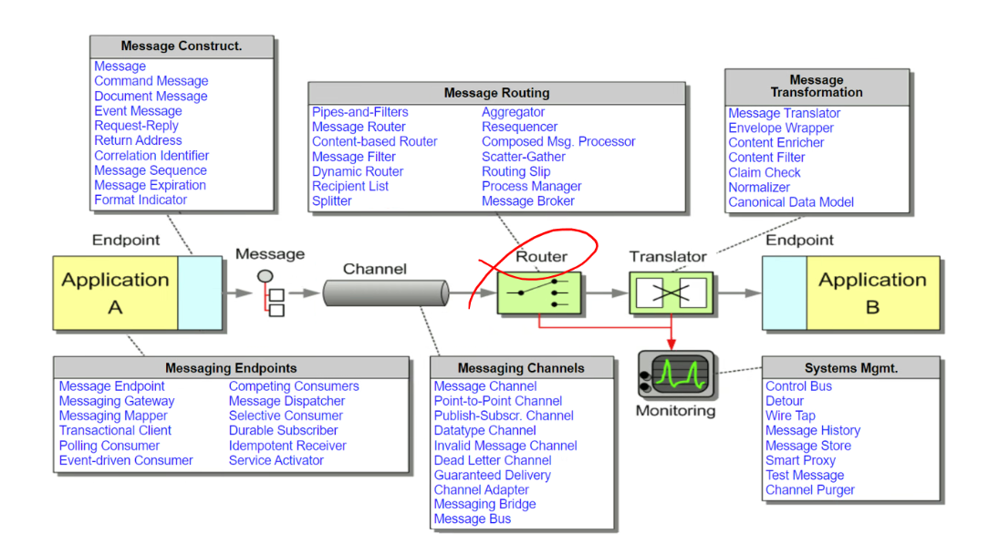
3. spring integration
    - https://spring.io/projects/spring-integration
## 2.一个简单的集成流
### 2.1集成流(integration flow)
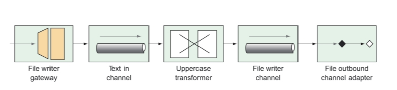
消息包含消息体（payload）和消息头（header）
### 2.2实现
1. 依赖
```xml
<dependency>
	<groupId>org.springframework.boot</groupId>
	<artifactId>spring-boot-starter-integration</artifactId>
</dependency>
<dependency>
	<groupId>org.springframework.integration</groupId>
	<artifactId>spring-integration-file</artifactId>
</dependency>
```
2. java代码
```java
// spring会自动实现这个接口
// 如果没有指定通道，消息将被发送到 "textInChannel"
@MessagingGateway(defaultRequestChannel="textInChannel")   // <1>
public interface FileWriterGateway {

  void writeToFile(
    // header中有FILENAME的key，值为这个string
      @Header(FileHeaders.FILENAME) String filename,       // <2>
      String data);

}

@SpringBootApplication
public class SimpleFlowApplication {

	public static void main(String[] args) {
		SpringApplication.run(SimpleFlowApplication.class, args);
	}
	
	@Bean
	public CommandLineRunner writeData(FileWriterGateway gateway, Environment env) {
	  return args -> {
	    String[] activeProfiles = env.getActiveProfiles();
	    if (activeProfiles.length > 0) {
	      String profile = activeProfiles[0];
          // 通过网关发送数据
	      gateway.writeToFile("simple.txt", "Hello, Spring Integration! (" + profile + ")");
	    } else {
	      System.out.println("No active profile set. Should set active profile to one of xmlconfig, javaconfig, or javadsl.");
	    }
	  };
	}
	
}

// 配置类
@Configuration
public class FileWriterIntegrationConfig {

  @Profile("xmlconfig")
  @Configuration
  @ImportResource("classpath:/filewriter-config.xml")
  public static class XmlConfiguration {}

  @Profile("javaconfig")
  @Bean
  @Transformer(inputChannel="textInChannel",
               outputChannel="fileWriterChannel")
  public GenericTransformer<String, String> upperCaseTransformer() {
    // transformer：将字符串转为全大写
    return text -> text.toUpperCase();
  }

  @Profile("javaconfig")
  @Bean
  @ServiceActivator(inputChannel="fileWriterChannel")
  // handler：对消息的处理
  public FileWritingMessageHandler fileWriter() {
    FileWritingMessageHandler handler =
        new FileWritingMessageHandler(new File("."));
    handler.setExpectReply(false);
    handler.setFileExistsMode(FileExistsMode.APPEND);
    handler.setAppendNewLine(true);
    return handler;
  }

// 以上指定的channel，spring会自动创建，也可以使用以下方法手动创建channel，channel名即为Bean名
//  @Bean
//  public MessageChannel fileWriterChannel() {
//    return new DirectChannel();
//  }

  //
  // DSL Configuration
  //
  // 这里会有一个FileWriterChannel，只不过没有名字
  // 你可以显式创建一个channnel以命名，见下
  @Profile("javadsl")
  @Bean
  public IntegrationFlow fileWriterFlow() {
    return IntegrationFlows
        .from(MessageChannels.direct("textInChannel"))
        .<String, String>transform(t -> t.toUpperCase())
        .handle(Files
            .outboundAdapter(new File("."))
            .fileExistsMode(FileExistsMode.APPEND)
            .appendNewLine(true))
        .get();
  }

  /*
  @Bean
  public IntegrationFlow fileWriterFlow() {
    return IntegrationFlows
        .from(MessageChannels.direct("textInChannel"))
        .<String, String>transform(t -> t.toUpperCase())
        .channel(MessageChannels.direct("FileWriterChannel"))
        .handle(Files
            .outboundAdapter(new File("C:/spring/ch10"))
            .fileExistsMode(FileExistsMode.APPEND)
            .appendNewLine(true))
        .get();
  }
   */

}

```
3. xml文件
```xml
<?xml version="1.0" encoding="UTF-8"?>
<beans xmlns="http://www.springframework.org/schema/beans"
  xmlns:xsi="http://www.w3.org/2001/XMLSchema-instance"
  xmlns:int="http://www.springframework.org/schema/integration"
  xmlns:int-file="http://www.springframework.org/schema/integration/file"
  xsi:schemaLocation="http://www.springframework.org/schema/beans
    http://www.springframework.org/schema/beans/spring-beans.xsd
    http://www.springframework.org/schema/integration
    http://www.springframework.org/schema/integration/spring-integration.xsd
    http://www.springframework.org/schema/integration/file
    http://www.springframework.org/schema/integration/file/spring-integration-file.xsd">

    <int:channel id="textInChannel" />             <!--1-->

    <int:transformer id="upperCase"
        input-channel="textInChannel"
        output-channel="fileWriterChannel"
        expression="payload.toUpperCase()" />      <!--2-->

    <int:channel id="fileWriterChannel" />         <!--3-->

    <int-file:outbound-channel-adapter id="writer"
        channel="fileWriterChannel"
        directory="."
        mode="APPEND"
        append-new-line="true" />                  <!--4-->

</beans>
```
4. 集成流配置
    - xml配置
       - 实现网关接口以接收数据
       - xml中定义channel，transformer，adapter等，然后使用xml配置即可
    - java配置
      - 实现网关接口以接收数据
      - 实现以上的两个Bean，然后使用java配置文件即可
    - 使用DSL的java配置
## 3.集成流的组件介绍
1. Channels（通道） —Pass messages from one element to another.
2. Filters（过滤器） —Conditionally allow messages to pass through the flow based on some criteria.
3. Transformers（转换器） —Change message values and/or convert message payloads from one type to another.
4. Routers（路由器） —Direct messages to one of several channels, typically based on message headers.
5. Splitters（切分器） —Split incoming messages into two or more messages, each sent to different channels.
6. Aggregators（聚合器） —The opposite of splitters, combining multiple messages coming in from separate channels into a single message.
7. Service activators（服务激活器） —Hand a message off to some Java method for processing, and then publish the return value on an output channel.
8. Channel adapters（通道适配器） —Connect a channel to some external system or transport. Can either accept input or write to the external system.
9. Gateways（网关） —Pass data into an integration flow via an interface.
### 3.1消息通道(Message channels)
1. PublishSubscribeChannel
    - 发布订阅通道
2. QueueChannel
    - 队列通道
3. PriorityChannel
    - 优先级通道
4. RendezvousChannel
5. DirectChannel（缺省）
6. ExecutorChannel
7. FluxMessageChannel
```java
@Bean
public MessageChannel orderChannel() {
    return new PublishSubscribeChannel();
}
```
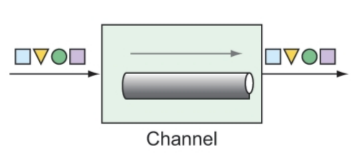
### 3.2过滤器(Filters)
```java
@Filter(inputChannel="numberChannel",
        outputChannel="evenNumberChannel")
public boolean evenNumberFilter(Integer number) {
    return number % 2 == 0;
}
```
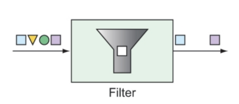
### 3.3转换器(Transformers)
1. 进出类型可同可不同
```java
@Bean
@Transformer(inputChannel="numberChannel",
             outputChannel="romanNumberChannel")
public GenericTransformer<Integer, String> romanNumTransformer() {
    return RomanNumbers::toRoman;
}

```
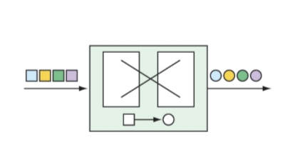
### 3.4路由器(Routers)
```java
@Bean
@Router(inputChannel="numberChannel")
public AbstractMessageRouter evenOddRouter() {
    return new AbstractMessageRouter() {
        @Override
        protected Collection<MessageChannel> determineTargetChannels(Message<?> message) {
            Integer number = (Integer) message.getPayload();
            if (number % 2 == 0) {
                return Collections.singleton(evenChannel());
            }
            return Collections.singleton(oddChannel());
        }
    };
}
@Bean
public MessageChannel evenChannel() {
    return new DirectChannel();
}
@Bean
public MessageChannel oddChannel() {
    return new DirectChannel();
}
```
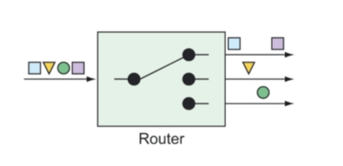
### 3.5切分器(Splitters)
1. 把一个消息切分成多个消息
2. 返回对象要是集合
```java
public class OrderSplitter {
    public Collection<Object> splitOrderIntoParts(PurchaseOrder po) {
        ArrayList<Object> parts = new ArrayList<>();
        parts.add(po.getBillingInfo());
        parts.add(po.getLineItems());
        return parts;
    }
}

@Bean
@Splitter(inputChannel="poChannel", outputChannel="splitOrderChannel")
public OrderSplitter orderSplitter() {
    return new OrderSplitter();
}

@Bean
@Router(inputChannel="splitOrderChannel")
public MessageRouter splitOrderRouter() {
    PayloadTypeRouter router = new PayloadTypeRouter();
    router.setChannelMapping(BillingInfo.class.getName(), "billingInfoChannel");
    router.setChannelMapping(List.class.getName(), "lineItemsChannel");
    return router;
}

@Splitter(inputChannel="lineItemsChannel", outputChannel="lineItemChannel")
public List<LineItem> lineItemSplitter(List<LineItem> lineItems) {
    return lineItems;
}
```
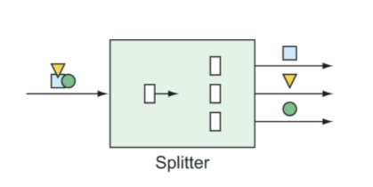
### 3.6服务激活器(Service activators)
1. 消息进来进行处理
2. Transformers可能可以实现相同功能，但两者在语义上不同
3. MessageHandler有时候也可以来实现通道适配器
```java
// MessageHandler实现，做完消息即停止
@Bean
@ServiceActivator(inputChannel="someChannel")
public MessageHandler sysoutHandler() {
    return message -> {
        System.out.println("Message payload: " + message.getPayload());
    };
}
// GenericHandler实现，做完消息继续流动
@Bean
@ServiceActivator(inputChannel="orderChannel", outputChannel="completeOrder")
public GenericHandler<TacoOrder> orderHandler(OrderRepository orderRepo) {
    return (payload, headers) -> {
        return orderRepo.save(payload);
    };
}
```
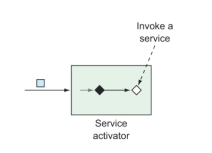
### 3.7网关(gataway)
```java
// 双向网关
// 方法有返回值，gateway
import org.springframework.integration.annotation.MessagingGateway;
import org.springframework.stereotype.Component;
@Component
@MessagingGateway(defaultRequestChannel="inChannel", defaultReplyChannel="outChannel")// 默认的响应通道，应用可以在这个通道上获得返回值
public interface UpperCaseGateway {
    String uppercase(String in);
}

@Bean
public IntegrationFlow uppercaseFlow() {
    return IntegrationFlows
            .from("inChannel")
            .<String, String> transform(s -> s.toUpperCase())
            .channel("outChannel")
            .get();
}
```
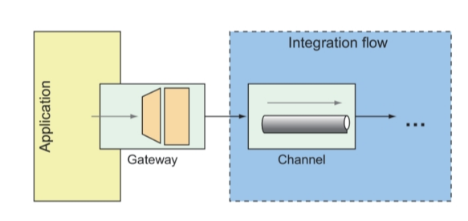
### 3.8通道适配器(Channel adapters)
1. 与外部交接的接口
2. 有Inbound和Outbound
```java
// 每秒获得一个整型值
@Bean
@InboundChannelAdapter(poller=@Poller(fixedRate="1000"), channel="numberChannel")// poller配置轮询器，每一秒轮询一次
public MessageSource<Integer> numberSource(AtomicInteger source) {
    return () -> {
        return new GenericMessage<>(source.getAndIncrement());
    };
}
// 每秒监听一次某目录下是否有新文件产生
@Bean
@InboundChannelAdapter(channel="file-channel", poller=@Poller(fixedDelay="1000"))
public MessageSource<File> fileReadingMessageSource() {
    FileReadingMessageSource sourceReader = new FileReadingMessageSource();
    sourceReader.setDirectory(new File(INPUT_DIR));
    sourceReader.setFilter(new SimplePatternFileListFilter(FILE_PATTERN));
    return sourceReader;
}
// DSL定义
@Bean
public IntegrationFlow someFlow(AtomicInteger integerSource) {
    return IntegrationFlows
            .from(integerSource, "getAndIncrement", 
                    c -> c.poller(Pollers.fixedRate(1000)))
            ...
            .get();
}

@Bean
public IntegrationFlow fileReaderFlow() {
    return IntegrationFlows
            .from(Files.inboundAdapter(new File(INPUT_DIR))
            .patternFilter(FILE_PATTERN))
            .get();
}
```
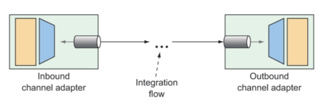
### 3.9端点模块(Endpoint modules)
1. 我们写入文件的方法是怎么来的，是这些端点模块提供的
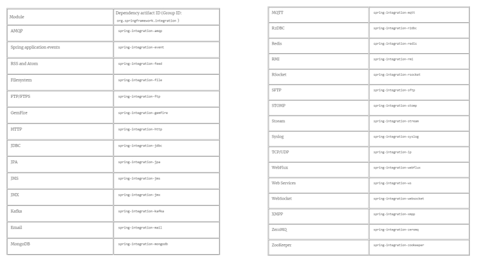
## 4.电子邮件集成流
### 4.1本节课目标
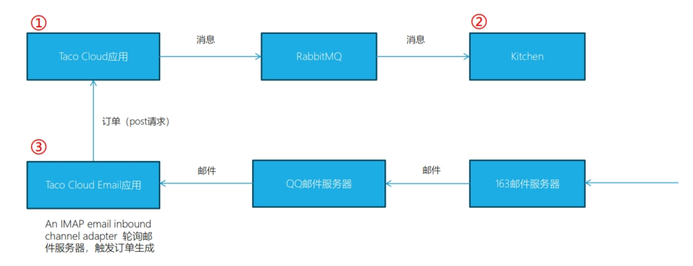
### 4.2电子邮件端点模块
```xml
<dependency>
      <groupId>org.springframework.integration</groupId>
      <artifactId>spring-integration-mail</artifactId>
</dependency>
```
### 4.3构建集成流
1. TacoOrderEmailIntegrationConfig.java （DSL方式）
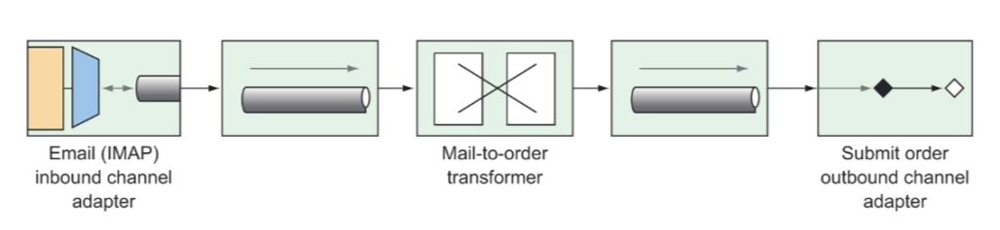
### 4.4设置QQ邮箱
1. https://wx.mail.qq.com/
2. 开启IMAP服务
3. 获取授权码
4. 配置
```yml
tacocloud:
  email:
    host: imap.qq.com
    mailbox: INBOX
    username: qq账号
    password: 授权码
    poll-rate: 10000
```
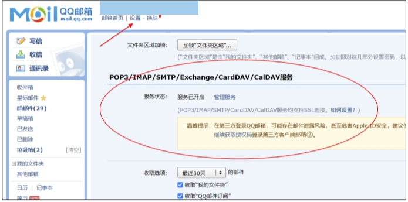
### 4.5发送邮件
1. 注意使用纯文本方式
    - 邮件主题：TACO ORDER
    - 邮件内容：TacoName1: flourTortilla,cornTortilla
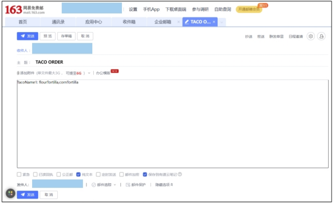


