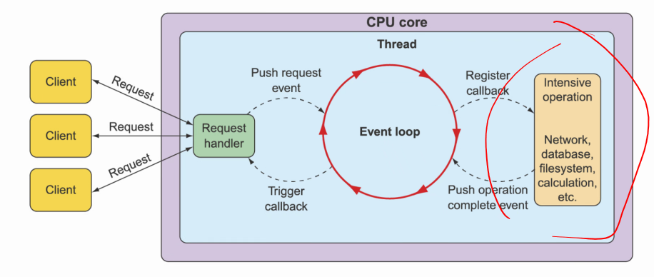
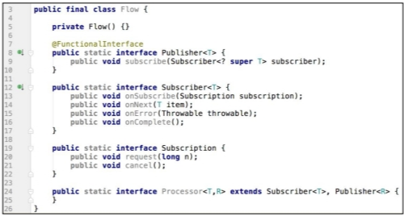
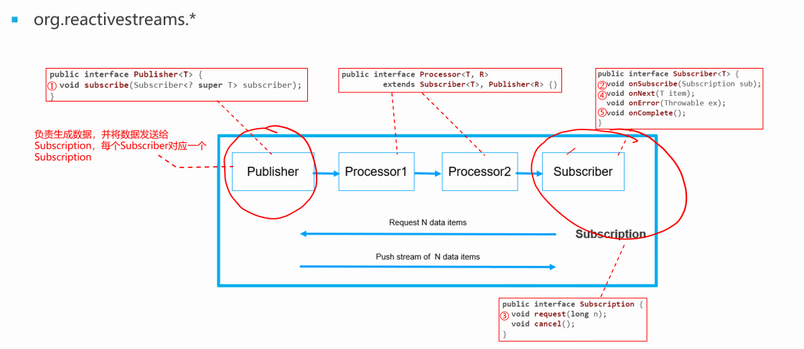
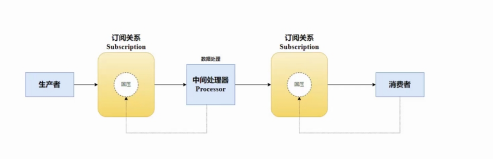
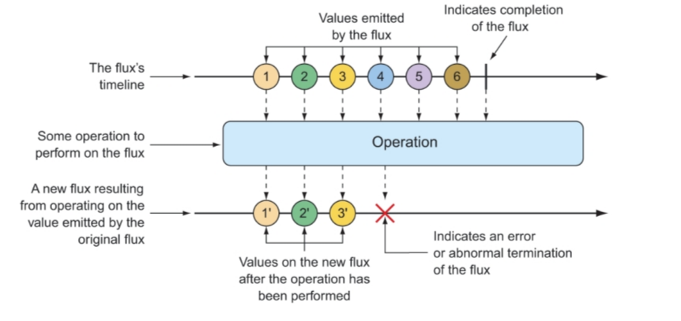
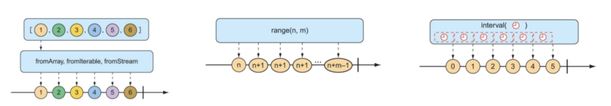

[toc]
# 反应式编程
## 1.两种不同的编程范式
1. 命令式编程，imperative
2. 反应式编程，Reactive Programming
## 2.Reactive Programming解决什么问题
1. IO密集型场景
2. 同步阻塞模型，阻塞线程多，CPU利用率不高，性能下降
3. 管理多线程，意味着更高的复杂性
4. 学习文档
    - 剖析Reactor 模型：
https://mp.weixin.qq.com/s?__biz=MzIwNDAyOTI2Nw==&mid=2247483716&idx=1&sn=91e7c3f7a46b6d054b8a938cefd3120d&chksm=96c72d78a1b0a46e6f3058c6c895496caab199184376d817a310fbd73620d55dd2bbc434b8d1&token=1026451003&lang=zh_CN#rd
    - Java NIO 底层原理：https://www.toutiao.com/article/6887439886178058759/
    - Netty介绍：https://www.zhihu.com/question/607575828/answer/3157903032
## 3.异步Web框架的事件轮询（event looping）机制
用更少的线程处理更多的请求，从而减少线程管理的开销

## 4.Reactor项目
```yml
<dependency>
    <groupId>io.projectreactor</groupId>
    <artifactId>reactor-core</artifactId>
</dependency>
```
1. Reactive Streams：Netflix、Lightbend和Pirotal于2013年开始制定的一种规范，旨在提供无阻塞回压的异步流处理标准
2. Reactor：Spring Pivotal团队提供的响应式编程的Java实现，其它类似实现：RxJava
    - **函数式、声明式**，描述数据会流经的管道或流
3. Spring WebFlux：启用基于响应式编程的Web应用程序的开发。提供类似于Spring MVC的编程模型
## 5.Java的stream与反应式的流区别
1. Java的stream通常都是同步的，并且只能处理有限的数据集，本质上来说，它们只是使用函数来对集合进行迭代的一种方式
2. JDK9中的 Flow API对应反应式流

## 6.反应式流规范定义的4个接口

1. Publisher：消息的发布者
2. Subscriber：消息的订阅者，消费数据
3. Processor：处理数据，既是发布者，也是订阅者
4. Subscription：相当于协调者，协调订阅者和消费者
    - request，订阅者向发布者请求若干个数据
    - publisher传递数据信息，subscriber请求数据
### 6.1例子（基于jdk）
```java
// 订阅者
public class EndSubscriber<T> implements Flow.Subscriber<T> {
    // 多少消息需要消费
    private final AtomicInteger howMuchMessagesToConsume;
    private Flow.Subscription subscription;
    // 保存消费过的消息
    public List<T> consumedElements = new LinkedList<>();

    public EndSubscriber(Integer howMuchMessagesToConsume) {
        this.howMuchMessagesToConsume = new AtomicInteger(howMuchMessagesToConsume);
    }

    // 订阅者第一次与发布者建立连接时调用
    @Override
    public void onSubscribe(Flow.Subscription subscription) {
        this.subscription = subscription;
        subscription.request(1);// 可以控制流的速度，回压
    }

    @Override
    public void onNext(T item) {
        System.out.println("Got : " + item);
        consumedElements.add(item);
        subscription.request(1);
    }

    @Override
    public void onError(Throwable throwable) {
        throwable.printStackTrace();
    }

    // 数据传输完毕
    @Override
    public void onComplete() {
        System.out.println("Done");
    }
}


@Test
public void whenSubscribeToIt_thenShouldConsumeAll()
        throws InterruptedException {

    // given
    SubmissionPublisher<String> publisher = new SubmissionPublisher<>();
    EndSubscriber<String> subscriber = new EndSubscriber<>(5);
    publisher.subscribe(subscriber);
    List<String> items = List.of("a", "b", "c", "d", "e", "f");

    // when
    assertThat(publisher.getNumberOfSubscribers()).isEqualTo(1);
    items.forEach(publisher::submit);
    publisher.close();

    // then
    await().atMost(1000, TimeUnit.MILLISECONDS)
            .until(
                    () ->{
//                      assertThat(subscriber.consumedElements).containsExactlyElementsOf(items);
                        return subscriber.consumedElements.size()==(items.size());}
            );
}


// Processor
public class TransformProcessor<T,R> extends SubmissionPublisher<R> implements Flow.Processor<T,R> {
    private Function<T,R> function;
    private Flow.Subscription subscription;

    public TransformProcessor(Function<T, R> function) {
        super();
        this.function = function;
    }

    @Override
    public void onSubscribe(Flow.Subscription subscription) {
        this.subscription = subscription;
        subscription.request(1);
    }

    @Override
    public void onNext(T item) {
        submit(function.apply(item));
        subscription.request(1);
    }

    @Override
    public void onError(Throwable t) {
        t.printStackTrace();
    }

    @Override
    public void onComplete() {
        close();
    }
}


@Test
public void whenSubscribeAndTransformElements_thenShouldConsumeAll() {
    // given
    SubmissionPublisher<String> publisher = new SubmissionPublisher<>();
    Function<String, String> dup = x -> x.concat(x);
    TransformProcessor<String, String> transformProcessor
            = new TransformProcessor<>(dup);
    EndSubscriber<String> subscriber = new EndSubscriber<>(6);
    List<String> items = List.of("1", "2", "3");
    List<String> expectedResult = List.of("11", "22", "33");
    // when
    publisher.subscribe(transformProcessor);
    transformProcessor.subscribe(subscriber);
    items.forEach(publisher::submit);
    publisher.close();

    await().atMost(1000, TimeUnit.MILLISECONDS)
            .untilAsserted(() -> assertTrue(subscriber.consumedElements.containsAll(expectedResult)));
}
```
## 7.回压
发布者有时发布的消息很快，订阅者处理不过来，要通过回压来控制流的速度

## 8.反应式流图（Flux）

## 9.两个基本概念：Flux 和 Mono
1. Flux：包含 0 到 N 个元素的异步序列
2. Mono：包含 0 或者 1 个元素的异步序列
3. 消息：正常的包含元素的消息、序列结束的消息和序列出错的消息
4. 操作符（Operator）：对流上元素的操作
### 9.1操作类型
1. 创建操作
2. 组合操作
3. 转换操作
4. 逻辑操作
### 9.2创建Flux
1. Flux的静态方法
2. 根据对象创建，just方法
3. 根据集成创建，数组、Iterable、Java Stream
4. range
5. interval

```java
// just方法
Flux<String> fruitFlux = Flux
        .just("Apple", "Orange", "Grape", "Banana", "Strawberry");
fruitFlux.subscribe(x->System.out.println(x)); // 订阅这个流，这个流才活，否则它什么也不做
// 数组
String[] fruits = new String[] {
    "Apple", "Orange", "Grape", "Banana", "Strawberry" };
Flux<String> fruitFlux = Flux.fromArray(fruits);
// Iterable     
List<String> fruitList = new ArrayList<>();
fruitList.add("Apple");
fruitList.add("Orange");
fruitList.add("Grape");
fruitList.add("Banana");
fruitList.add("Strawberry");
Flux<String> fruitFlux = Flux.fromIterable(fruitList);
// Stream
Stream<String> fruitStream =
    Stream.of("Apple", "Orange", "Grape", "Banana", "Strawberry");
Flux<String> fruitFlux = Flux.fromStream(fruitStream);
// interval
Flux<Long> intervalFlux =
    Flux.interval(Duration.ofSeconds(1))// 每隔一秒产生一个数据，从0开始
        .take(5);
// range
Flux<Integer> intervalFlux =
    Flux.range(1, 5);
```
### 9.3组合Flux流
1. mergeWith
2. zip
3. zip，提供合并函数
4. first
```java
// merge
Flux<String> characterFlux = Flux
    .just("Garfield", "Kojak", "Barbossa")
    .delayElements(Duration.ofMillis(500));
Flux<String> foodFlux = Flux
    .just("Lasagna", "Lollipops", "Apples")
    .delaySubscription(Duration.ofMillis(250))
    .delayElements(Duration.ofMillis(500));

Flux<String> mergedFlux = characterFlux.mergeWith(foodFlux);
mergedFlux.doOnNext(System.out::println).blockLast();

// zip，将两个流的数据合成一个数据
Flux<String> characterFlux = Flux
    .just("Garfield", "Kojak", "Barbossa");
Flux<String> foodFlux = Flux
    .just("Lasagna", "Lollipops", "Apples");

Flux<Tuple2<String, String>> zippedFlux =
    Flux.zip(characterFlux, foodFlux);

// zip，提供合并函数
Flux<String> characterFlux = Flux
    .just("Garfield", "Kojak", "Barbossa");
Flux<String> foodFlux = Flux
    .just("Lasagna", "Lollipops", "Apples");

Flux<String> zippedFlux =
    Flux.zip(characterFlux, foodFlux, (c, f) -> c + " eats " + f);

// first，哪个流的数据先到，就采用哪个流
Flux<String> slowFlux = Flux.just("tortoise", "snail", "sloth")
        .delaySubscription(Duration.ofMillis(100));
Flux<String> fastFlux = Flux.just("hare", "cheetah", "squirrel");

Flux<String> firstFlux = Flux.firstWithSignal(slowFlux, fastFlux);
```
### 9.4过滤Flux流
1. skip指定个数
2. skip指定时长
3. take指定个数
4. take指定时长
```java
// skip个数
Flux<String> countFlux = Flux.just(
    "one", "two", "skip a few", "ninety nine", "one hundred")// just生成一个流
    .skip(3);// skip返回新的流
// skip时长
Flux<String> countFlux = Flux.just(
    "one", "two", "skip a few", "ninety nine", "one hundred")
    .delayElements(Duration.ofSeconds(1))
    .skip(Duration.ofSeconds(4));// 跳过前面4s产生的数据
// take个数
Flux<String> nationalParkFlux = Flux.just(
    "Yellowstone", "Yosemite", "Grand Canyon", "Zion", "Acadia")
    .take(3);
// take时长
Flux<String> nationalParkFlux = Flux.just(
    "Yellowstone", "Yosemite", "Grand Canyon", "Zion", "Grand Teton")
    .delayElements(Duration.ofSeconds(1))
    .take(Duration.ofMillis(3500));
```
1. filter，需要提供Predicate
2. distinct，只发布源Flux中尚未发布过的数据项
```java
// filter
Flux<String> nationalParkFlux = Flux.just(
    "Yellowstone", "Yosemite", "Grand Canyon", "Zion", "Grand Teton")
    .filter(np -> !np.contains(" "));// 有两个流
// distinct
Flux<String> animalFlux = Flux.just(
    "dog", "cat", "bird", "dog", "bird", "anteater")
    .distinct();
```
### 9.5转换Flux流
1. map，同步
2. flatMap，异步
    - 将原来的流中的每个元素转换为一个新的流，然后再将这些流合并为一个流
    - 我们对每个流可以放在不同线程中并发处理
    - 并发模型（Schedulers方法）
      - .immediate()
      - .single()，单个线程
      - .newSingle()
      - .elastic()
      - .parallel()
```java
// map
Flux<Player> playerFlux = Flux
    .just("Michael Jordan", "Scottie Pippen", "Steve Kerr")
    .map(n -> {
        String[] split = n.split("\\s");
        return new Player(split[0], split[1]);
    });// map在第一个流的基础上产生第二个流

// flatMap
Flux<Player> playerFlux = Flux
    .just("Michael Jordan", "Scottie Pippen", "Steve Kerr")
    .flatMap(n -> Mono.just(n)
        .map(p -> {
            String[] split = p.split("\\s");
            return new Player(split[0], split[1]);
        })
        .subscribeOn(Schedulers.parallel()) // 并发执行
    );
```
1. buffer，缓冲数据，bufferAndFlatMap
2. collectList，同：buffer不带参数则缓冲所有数据到列表
3. collectMap，需要提供生成key的函数
```java
// buffer
Flux<String> fruitFlux = Flux.just(
    "apple", "orange", "banana", "kiwi", "strawberry");

Flux<List<String>> bufferedFlux = fruitFlux.buffer(3);

// bufferAndFlatMap
Flux.just(
    "apple", "orange", "banana", "kiwi", "strawberry")
    .buffer(3)
    .flatMap(x ->
        Flux.fromIterable(x)
        .map(y -> y.toUpperCase())
        .subscribeOn(Schedulers.parallel())
        .log()
    ).subscribe();

// collectList
Flux<String> fruitFlux = Flux.just(
    "apple", "orange", "banana", "kiwi", "strawberry");

Mono<List<String>> fruitListMono = fruitFlux.collectList();

// collectMap
Flux<String> animalFlux = Flux.just(
    "aardvark", "elephant", "koala", "eagle", "kangaroo");

Mono<Map<Character, String>> animalMapMono =
    animalFlux.collectMap(a -> a.charAt(0));
```
### 9.6对流执行逻辑操作
1. all，需要提供Predicate函数，注意返回类型Mono<Boolean>
    - 流中的全部元素
2. any，需要提供Predicate函数，注意返回类型Mono<Boolean>
    - 流中的任一元素
```java
// all
Flux<String> animalFlux = Flux.just(
    "aardvark", "elephant", "koala", "eagle", "kangaroo");

Mono<Boolean> hasAMono = animalFlux.all(a -> a.contains("a"));
// any
Flux<String> animalFlux = Flux.just(
    "aardvark", "elephant", "koala", "eagle", "kangaroo");

Mono<Boolean> hasAMono = animalFlux.any(a -> a.contains("a"));
```

## 复习
1. 三类消息
    - 反应式编程的消息可以认为是java的对象
    - spring integration里的消息包含消息体和消息头
    - 消息中间件：有消息体和消息头，需要提供**消息转换器**（需要远程传输）
2. Map与flatMap
    - flatMap返回流（这个流被最终的返回流所驱动），可以做并发处理，最终汇聚成一个流

