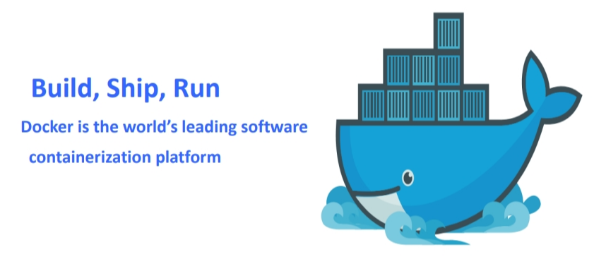

[toc]
# Spring WebFlux
## 1.异步Web框架的事件轮询(event looping)机制
用更少的线程处理更多的请求，从而减少线程管理的开销

## 2.Spring MVC与Spring WebFlux的共性与不同
都是处理来自客户端的请求
WebFlux也可以使用@Controller等注释，也提供了Router functions（路由函数）

## 3.Reactive Microservices With Spring Boot

1. Spring提供了**反应式的Spring Data**的实现
## 4.依赖
```xml
<dependency>
    <groupId>org.springframework.boot</groupId>
    <artifactId>spring-boot-starter-webflux</artifactId>
</dependency>
```
### 4.1代码
1. 编写反应式控制器Get、Post
```java
public interface IngredientRepository
        extends ReactiveCrudRepository<Ingredient, Long> {
    Mono<Ingredient> findBySlug(String slug);
}

@GetMapping("/{id}")
public Mono<Ingredient> byId(@PathVariable String id) {
    return repo.findBySlug(id);
}

@PostMapping
public Mono<ResponseEntity<Ingredient>> postIngredient(@RequestBody Mono<Ingredient> ingredient) {
    return ingredient
            .flatMap(repo::save)
            .map(i -> {
                HttpHeaders headers = new HttpHeaders();
                headers.setLocation(URI.create("http://localhost:8080/ingredients/" + i.getId()));
                return new ResponseEntity<Ingredient>(i, headers, HttpStatus.CREATED);
            });
}

@PutMapping("/{id}")
public void updateIngredient(@PathVariable Long id, @RequestBody Ingredient ingredient) {
    if (!ingredient.getId().equals(id)) {
        throw new IllegalStateException("Given ingredient's ID doesn't match the ID in the path.");
    }
    repo.save(ingredient).subscribe(); // 一定要订阅这个流的处理才生效，否则什么也不发生
}

@DeleteMapping("/{id}")
public void deleteIngredient(@PathVariable String id) {
    repo.findBySlug(id)
            .flatMap(ingredient -> repo.delete(ingredient))
            .subscribe();
}
```
2. 请求立刻返回流，客户端订阅驱动这个流
```java
@GetMapping(value="/mono")
public Mono<String> stringMono() {
    Mono<String> from = Mono.fromSupplier(() -> { // 流的处理过程，客户端订阅后等待数据库处理，而新请求可以不断进来
        try {
            TimeUnit.SECONDS.sleep(5);
        } catch (InterruptedException e) {
            throw new RuntimeException(e);
        }
        System.out.println(" in Supplier thread: " + Thread.currentThread().getName());
        return "Hello, Spring Reactive data time:" + LocalDateTime.now();
    });
    System.out.println("thread: " + Thread.currentThread().getName() + ", time:" + LocalDateTime.now());
    return from; // 流立刻返回到客户端
}
```
### 4.2端到端反应式栈

### 4.3R2DBC
1. 反应式关系型数据库连接（reactive relational database connectivity）
2. 是JDBC的替代方案，实现非阻塞的持久化操作
```xml
<!-- 依赖 -->
<dependency>
    <groupId>org.springframework.boot</groupId>
    <artifactId>spring-boot-starter-data-r2dbc</artifactId>
</dependency>
<!-- H2数据库和反应式驱动 -->
<dependency>
	<groupId>com.h2database</groupId>
	<artifactId>h2</artifactId>
	<scope>runtime</scope>
</dependency>
<dependency>
	<groupId>io.r2dbc</groupId>
	<artifactId>r2dbc-h2</artifactId>
	<scope>runtime</scope>
</dependency>
```
## 5.使用函数式编程范式来定义控制器（了解）
1. 使用函数式编程风格来定义endpoints的功能
2. 框架引入了两个基本组件：HandlerFunction 和 RouterFunction
3. HandlerFunction 表示处理接收到的请求并生成响应的函数
4. RouterFunction 替代了 @RequestMapping 注解。它用于将接收到的请求路由到处理函数
### 5.1代码
```java
// org.springframework.web.reactive.function.server
// RequestPredicate，声明要处理的请求类型
// RouterFunction，声明如何将请求路由到处理器代码中
// ServerRequest，代表一个http请求，包括对请求头和请求体的访问
// ServerResponse，代表一个http响应，包括响应头和响应体信息

// 第一个参数为请求路径，第二个参数为HandleFunction
public RouterFunction<?> helloRouterFunction() {
    return route(GET("/hello"),
        request -> ok().body(just("Hello World!"), String.class))
      .andRoute(GET("/bye"),
        request -> ok().body(just("See ya!"), String.class))
      ;
}

// 客户端调用Rest API
public class GreetingClient {

  private final WebClient client;

  // Spring Boot auto-configures a `WebClient.Builder` instance with nice defaults and customizations.
  // We can use it to create a dedicated `WebClient` for our component.
  public GreetingClient(WebClient.Builder builder) {
    this.client = builder.baseUrl("http://localhost:8080").build();
  }

  public Mono<String> getMessage() {
    return this.client.get().uri("/hello2").accept(MediaType.APPLICATION_JSON)
        .retrieve() // 发起请求
        .bodyToMono(Greeting.class)
        .map(Greeting::getMessage);
  }

}


// WebTestClient
@Test
public void testHello() {
    webTestClient
            // Create a GET request to test an endpoint
            .get().uri("/hello2")
            .accept(MediaType.APPLICATION_JSON)
            .exchange()
            // and use the dedicated DSL to test assertions against the response
            .expectStatus().isOk()
            .expectHeader().contentType(MediaType.APPLICATION_JSON)
            .expectBody(Greeting.class).value(greeting -> {
                assertThat(greeting.getMessage()).isEqualTo("Hello, Spring!");
            });
    }
```
## 6.docker

### 6.1容器与虚机

### 6.2docker的三部分
1. Docker daemon就是Docker Engine，一般在宿主主机后台运行
2. 用户使用client通过pipe、unix socket或tcp直接跟daemon交互
3. Docker index指向Docker registries，也叫docker仓库，可以用来让你上传和
下载images。Hub.docker.com为docker官方仓库

### 6.3docker可运行在
1. Windows
2. OS X
3. Linux
4. docker是基于linux操作系统
### 6.4Windows下的两类容器
1. Windows Container
2. linux Container
3. docker的容器指的是linux Container
## 复习
轮询：使用更少的线程处理请求
Spring MVC与Spring WebFlux的底层框架是不同的