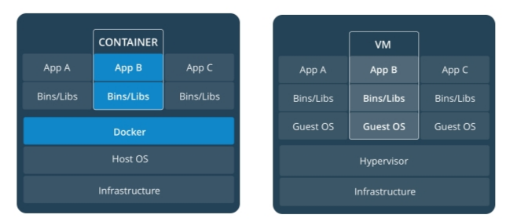
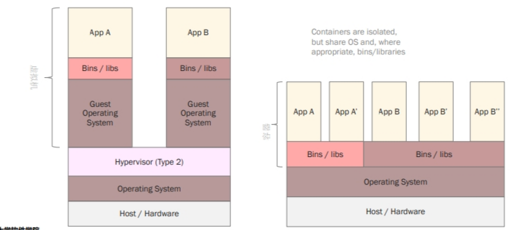
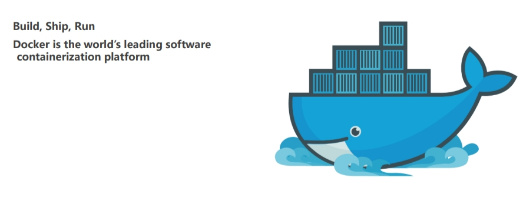
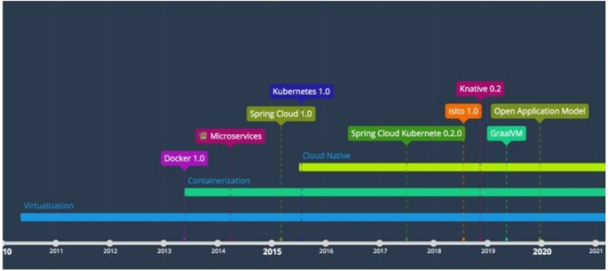
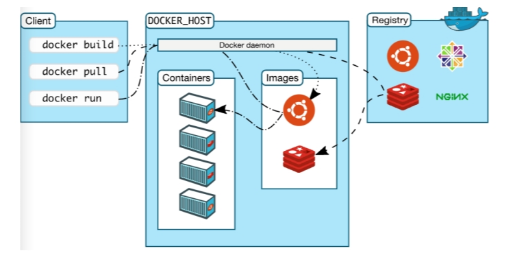
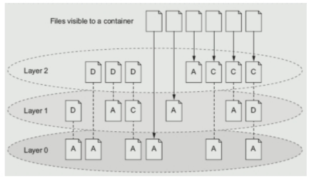
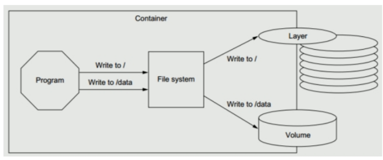
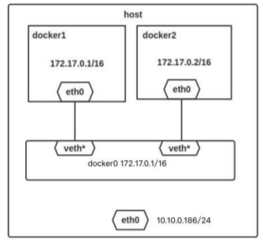

[toc]
# docker
## 1.什么是容器
容器是另外一种轻量级的虚拟化，容器是共用主机内核，利用内核的虚拟化技术隔离出一个独立的运行环境，拥有独立的一个文件系统，网络空间，进程空间视图等
## 2.容器与虚机

## 3.从虚拟化层看容器，轻量级、高性能是核心价值
1. 容器是在Linux内核实现的轻量级资源隔离机制
2. 虚拟机是操作系统级别的资源隔离，容器本质上是进程级的资源隔离

## 4.Docker


### 4.1Docker可运行在以下操作系统
1. Windows
2. OS X
3. Linux
### 4.2Windows下的两种容器
1. Windows Container
2. Linux Container
### 4.3Docker的三部分

1. Docker Desktop
    - Client跑在Windows上
    - Docker daemon跑在linux上
### 4.4Docker基本命令
1. docker
2. docker container --help
3. dockers --version
4. docker version
5. docker info
6. docker image ls
7. docker pull
8. 搜索镜像
    - docker search mongo
9. docker run hello-world
    - -d: 后台运行容器，并返回容器ID
    - -i: 以交互模式运行容器，通常与 -t 同时使用
    - -t: 为容器重新分配一个伪输入终端，通常与 -i 同时使用
    - -p: 指定（发布）端口映射，格式为：主机(宿主)端口:容器端口
    - -P: 随机端口映射，容器内部端口随机映射到主机的高端口
    - --name="nginx-lb": 为容器指定一个名称
    - -e username="ritchie": 设置环境变量
    - --env-file=c:/temp1/t1.txt: 从指定文件读入环境变量
    - --expose=2000-2002: 开放（暴露）一个端口或一组端口；
    - --link my-mysql:taozs : 添加链接到另一个容器
    - -v c:/temp1:/data: 绑定一个卷(volume)
    - --rm: 退出时自动删除容器
    - docker run --rm --it --name=my-container container
    - docker run -d -p 8080:80 nginx
#### 4.4.1练习：gcc
1. 运行两个容器
    - docker run --rm -v C:\codec\gcc-hw:/hw -w /hw –it --name=server nercury/cmake-cpp:gcc-5.2
    - docker run --rm -v C:\codec\gcc-hw:/hw -w /hw –it --name=client nercury/cmake-cpp:gcc-5.2
2. 编译并运行两个.c文件
3. -w设置容器的工作目录，这样在容器启动时会直接定位到这个目录。
#### 4.4.2练习：mysql的启动和访问
```sh
# 拉取镜像
docker pull mysql:5.7
# 运行镜像并设置环境变量
docker run --name my-mysql -e MYSQL_ROOT_PASSWORD=exampledb20 -d mysql:5.7
# --link 链接到my-mysql容器，server 是在当前容器中用来引用该容器的别名。
# -h指定的host
docker run -it --rm --link my-mysql:server mysql:5.7 mysql –hserver -uroot -pexampledb20
# 不使用别名
docker run -it --rm --link my-mysql mysql:5.7 mysql –hmy-mysql -uroot -pexampledb20
```
## 5.镜像分层
1. 写时复制(COW, Copy-On- Write)
2. docker history imagename 查看镜像的层

## 6.数据卷(volume)
1. Docker-managed volume（docker管理卷）
    - docker自身管理的volume
2. Bind mount volume（绑定挂载卷）
    - 将宿主机上的目录映射到容器中

## 7.导入和导出容器镜像
1. 针对容器导出，然后导入到镜像
    - docker export 1e560fca3906 > ubuntu.tar，导出该容器快照到本地文件ubuntu.tar
    - docker import ubuntu.tar test/ubuntu:v1，将该快照文件导入到镜像test/ubtuntu:v1
    - docker import http://example.com/exampleimage.tgz example/imagerepo
2. 针对镜像备份
    - 备份：docker save -o 文件名.tar 镜像
    - 恢复：docker load -i 文件名.tar
## 8.dangling镜像
1. dangling是一种特殊的，不会再被使用到的镜像，即无tag的镜像
2. docker image ls -f dangling=true
3. docker image prune -f
## 9.docker system命令
1. docker system df命令，类似于Linux上的df命令，用于查看Docker的磁盘使用情况
2. RECLAIMBLE指可回收的，对image，指的是没有被容器使用的镜像
3. docker system events
## 10.容器网络
1. none网络，--net=none
2. host网络，--net=host
    - 使用宿主机的网络
3. bridge网络，--net=bridge，docker0 的linux bridge
4. container模式，--net=container:NAME_or_ID
    - 两个容器共享同一个ip地址和端口号


## 复习
1. docker三部分可能会考
    - docker daemon：运行在主机上的服务端程序，负责管理镜像、容器、网络和存储等组件。它响应来自Docker客户端的请求，并管理容器的创建、运行和停止等操作。
    - docker client：与Docker守护进程通信的命令行工具或API，允许用户通过命令行或其他接口与Docker守护进程交互
    - registry：镜像仓库，管理镜像
2. 查容器的ip地址：
    - docker desktop来查
    - cat /etc/hosts
    - ip a
3. --link的作用
    - 把别名写在配置文件中，而对应容器可以动态变化
4. 网络不考