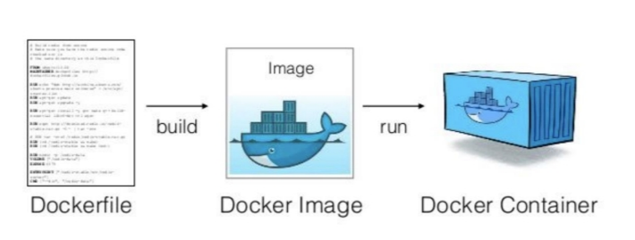
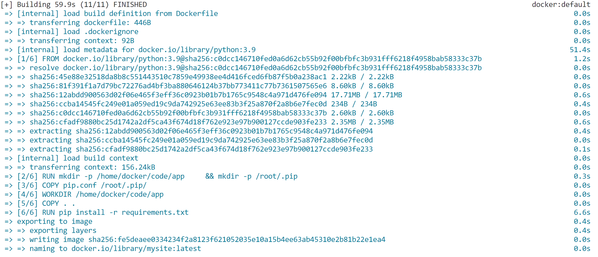
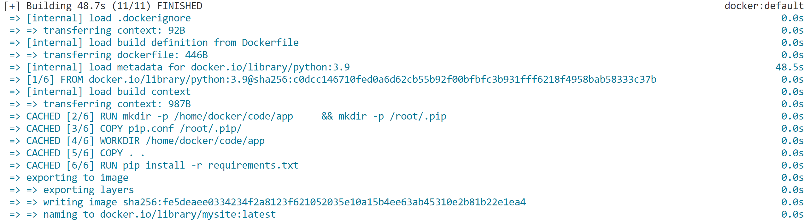
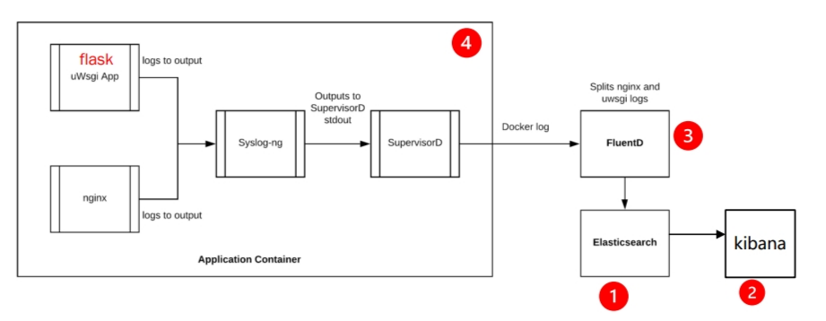
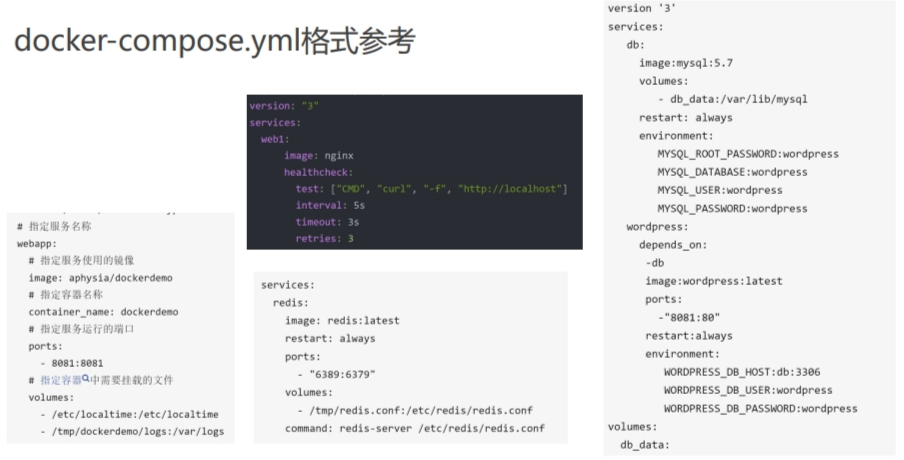

[toc]
# 容器镜像构建与编排
## 1.由dockerfile构建镜像

## 2.Dockerfile文件的指令
1. FROM：指定基础镜像，必须为第一个命令
2. RUN：构建镜像时执行的命令(linux命令)
3. ADD：将本地文件添加到容器中，tar类型文件会自动解压
4. COPY：功能类似ADD，但是不会自动解压文件
5. CMD：构建容器后调用，也就是在容器启动时才进行调用
6. ENTRYPOINT：配置容器，使其可执行化。配合CMD可省去“application”，只使用参数，用于docker run时根据不同参数执行不同功能
    - 如果一个Dockerfile中有多个CMD或ENTRYPOINT，只有最后一个会生效，前面其他的都会被覆盖
    - CMD会被docker run 中的参数命令覆盖
    - ENTRYPOINT不会被docker run 中的参数命令覆盖
    - 如果在Dockerfile中CMD与ENTRYPOINT都存在，则CMD中的指令将会被作为ENTRYPOINT中的参数，即这时候CMD里的指令会失去它的作用，只是作为一个参数（可以理解为就是字符串）了，而且这个时候docker run后的参数指令依然会覆盖CMD，但是也会失去他本身的作用，仅仅是作为参数（字符串）提供给ENTRYPOINT中的命令
7. LABEL：用于为镜像添加元数据
8. ENV：设置环境变量
9.  EXPOSE：指定与外界交互的端口，容器内的端口号，docker run时加-P则会映射一个随机号（宿主机）
10. VOLUME：用于指定持久化目录，docker run时如果没有指定挂载目录，会创建一个volume
11. WORKDIR：工作目录，类似于cd命令
12. USER：指定运行容器时的用户名或 UID
13. ARG：用于指定传递给构建运行时的变量
14. ONBUILD：用于设置镜像触发器
## 3.Dockerfile练习
1. 命令
    - 生成镜像：docker build -t mysite:latest .
      - 最后一个参数`.`：上下文(context)
    - 运行容器：docker run -d --name mysite -p 8081:80 mysite:latest
2. dockerfile中的某些指令会产生一个层，如果再次构建时某一层的文件没有变化，则从缓存中取得，直到遇到变化的层，才重新构建

## 4.Docker build
1. docker build [OPTIONS] PATH | URL | -
2. 如何编写最佳的Dockerfile： https://zhuanlan.zhihu.com/p/26904830
    - .dockerignore文件
    - 容器只运行单个应用
    - 将多个RUN指令合并为一个
        - 有镜像分层
    - 基础镜像的标签不要用latest
        - latest具有可变性，不稳定
    - 每个RUN指令后删除多余文件
    - 选择合适的基础镜像(alpine版本最好，轻量级镜像)
    - 设置WORKDIR和CMD
    - 合理调整COPY和RUN的顺序
      - 变化少的在前
    - 使用ENTRYPOINT
3. Docker健康检查HEALTHCHECK的使用方法：https://zhuanlan.zhihu.com/p/386986915
4. 镜像分层--将所有的RUN指令合并为一个
    - Dockerfile中的每个指令都会创建一个新的镜像层
    - 镜像层将被缓存和复用
    - 当Dockerfile的指令修改了，复制的文件变化了，或者构建镜像时指定的变量不同了，对应的镜像层缓存就会失效
    - 某一层的镜像缓存失效之后，它之后的镜像层缓存都会失效
    - 镜像层是不可变的，如果我们在某一层中添加一个文件，然后在下一层中删除它，则镜像中依然会包含该文件(只是这个文件在Docker容器中不可见了)
## 5.服务编排工具，docker-compose
1. Compose 项目是 Docker 官方的开源项目，负责实现对 Docker 容器集群的快速编排
2. 一个单独的 docker-compose.yml 模板文件（YAML 格式）来定义一组相关联的应用容器为一个项目（project）
3. Compose 的默认管理对象是项目，通过子命令对项目中的一组容器进行便捷地生命周期管理
4. Compose 中有两个重要的概念
    - 服务(service)：一个应用的容器（可能会有多个容器），实际上可以包括若干运行相同镜像的容器实例
    - 项目(project)：由一组关联的应用容器组成的一个完整业务单元，在 docker-compose.yml 文件中定义
5. 使用微服务架构的系统一般包含若干个微服务，每个微服务一般部署多个实例。如果每个服务都要手动启停，那么效率低，维护量大
### 5.1docker-compose.yml格式
1. https://blog.csdn.net/weixin_46545831/article/details/112995427
2. https://zhuanlan.zhihu.com/p/93459395
### 5.2docker-compose练习

1. kibana：图形化界面
2. elasticsearch：数据库
3. FluentD：日志收集
4. 服务
    - syslog-ng：收集日志
    - SupervisorD：管理应用程序
    - 该容器输出的log，docker把它送到日志驱动程序的相关位置
### 5.3ports、expose、links、depends_on
1. https://zhuanlan.zhihu.com/p/382779508
2. ports
    - 用来把服务端口映射给宿主机
3. expose
    - 用来把服务端口开放给其他服务，客户端服务可以通过links功能访问服务端服务的端口
4. links
    - links的目的是把一个服务的名称在当前服务里面创建一个别名
5. depends_on
    - 当前服务启动之前先要把depends_on指定的服务启动起来才行
### 5.4配置 Docker Logging 驱动
1. Logging 驱动是可以插拔的框架
2. Logging 驱动是 Container 用来使用服务来访问 log data 的工具
3. Docker 支持很多种类的 Logging Driver
4. 默认驱动（log-driver）: "json-file"，存放到主机目录：/var/lib/docker/containers/[容器ID]-json.log
5. 单个容器的日志配置
    - docker run --log-driver syslog nginx
    - docker run --log-driver json-file --log-opt max-size=50m nginx 
6. 更多驱动：fluentd、splunk、awslogs
### 5.5docker-compose常用命令
1. docker-compose --help
2. docker-compose up -d # 该命令十分强大，它将尝试自动完成包括构建镜像，（重新）创建服务，启动服务，并关联服务相关容器的一系列操作
3. docker-compose ps、docker-compose ps --services
    - 当前目录的yml文件的那些服务对应的容器信息，images也同样
4. docker-compose images
5. docker-compose stop # 终止整个服务集合
6. docker-compose stop nginx # 终止指定的服务 （这有个点就是启动的时候会先启动 depond_on 中的容器，关闭的时候不会影响到 depond_on 中的）
7. docker-compose logs -f [services...] # 查看容器的输出日志
8. docker-compose build [SERVICE...]
    - 默认镜像名为文件夹名+服务名
    - 可以在yml文件中指定image参数来指定镜像
9.  docker-compose rm nginx # 移除指定的容器
10. docker-compose up -d --scale flask=3 organizationservice=2 #设置指定服务运行的容器个数
### 5.6docker-compose.yml格式参考

## 复习
1. ADD和COPY的区别、CMD
2. docker build命令
3. 如何编写最佳的Dockerfile（重要）
4. yaml文件基本语法
5. docker-compose常用命令（重要）