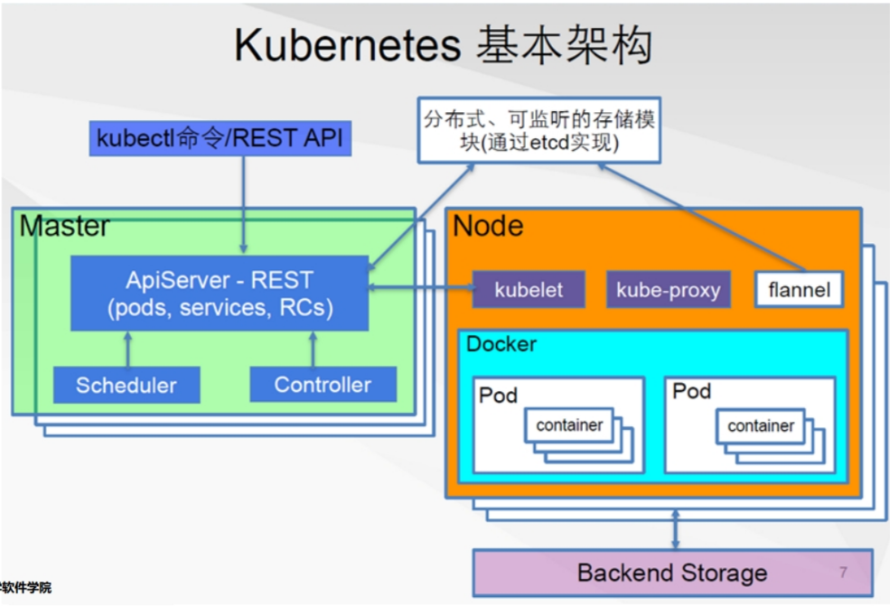
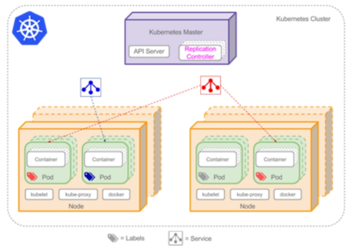
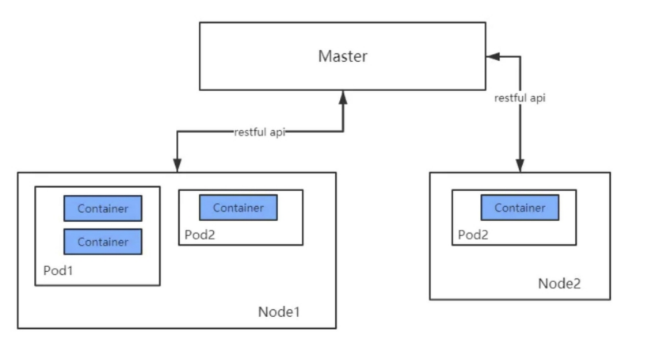
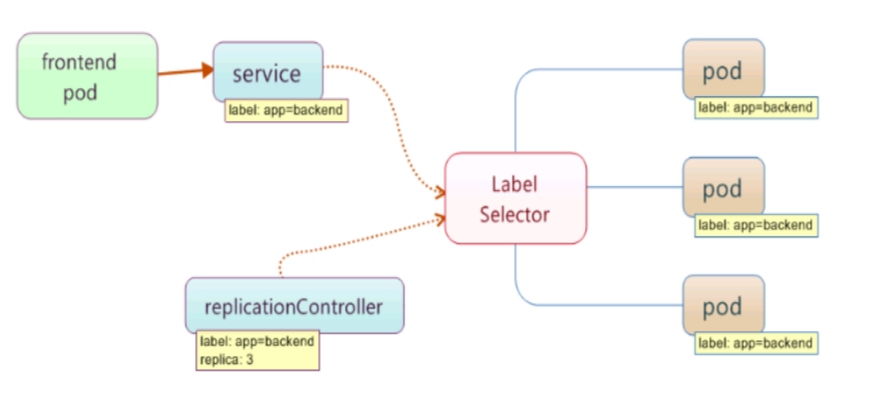

[toc]
# k8s
## 1.部署dashboard
1. `kubectl apply -f kubernetes-dashboard.yaml`
2. 检查 kubernetes-dashboard 应用状态
    - kubectl get pod -n kubernetes-dashboard
3. 将k8s server代理到本地端口：kubectl proxy
4. 配置控制台访问令牌
## 2.启动ingress controller
1. `kubectl apply -f ingress-nginx-controller.yaml`
## 3.验证 Kubernetes 集群状态
1. kubectl cluster-info
2. kubectl get nodes
3. kubectl get nodes --show-labels
4. 给节点打标签（key-value）：kubectl label node docker-desktop disktype=ssd
    - 查询满足标签的节点：kubectl get nodes -l disktype=ssd
    - 删除标签：kubectl label node docker-desktop disktype-
## 4.k8s基本架构

1. master节点是大脑，需要k8s的核心模块（Scheduler，Controller，apiServer等）
2. node节点需要安装docker（获得容器）和k8s的一些模块（作为master和docker之间的纽带，比如kubelet、kube-proxy）
3. etcd：类似redis的一个缓存系统
## 5.k8s中的资源
1. namespace
    - 命名空间
    - 类似java的包，不同namespace中可以有同名资源
    - 不指定namespace默认在default
2. pods
    - k8s最小可部署的单元，若干个容器的集合，它们共享文件系统和网络
3. ReplicaSet
    - 一个服务对应若干个pods，它用来管理监控这些pods
    - 一个服务要有5个pod，它如果发现有一个挂了会检测到
4. Deployment
    - 可以用来创建pod，有许多自动化的处理
5. Service
    - 同微服务的概念
    - 可以有多个pod部署，对外表现为一个服务名
6. ingress
    - 指定不同的域名或url后缀所对应的服务，即网关
7. configmap
    - 提供配置信息
    - key-value格式
8. secrets
    - 涉及安全的资源
    - 有不同类型
9.  serviceaccounts
    - 给开发出的微服务使用，与k8s进行交互
10. daemonSet
    - 用于在不同的pods上部署常驻系统
## 6.核心概念

### 6.1Pod、Container与Node之间的关系

### 6.2label

### 6.3Pod
1. 学习链接：https://www.jianshu.com/p/ce71385e0370
2. Pod是Kubernetes调度的最小单元
3. 一个Pod可以包含一个或多个容器，因此它可以被看作是内部容器的逻辑宿主机。Pod的设计理念是为了支持多个容器在一个Pod中**共享网络和文件系统**
    - PID命名空间：Pod中不同的应用程序可以看到其他应用程序的进程ID
    - network命名空间：Pod中多个容器处于同一个网络命名空间，因此能够访问的**IP和端口范围**都是相同的。也可以通过localhost相互访问
    - IPC命名空间：Pod中的多个容器共享Inner-process Communication命名空间，因此可以通过SystemV IPC或POSIX进行进程间通信
    - UTS命名空间：Pod中的多个容器共享同一个主机名
    - Volumes：Pod中各个容器可以共享在Pod中定义分存储卷（Volume）
4. restartPolicy字段
    - Always：只要退出就重启
    - OnFailure：失败退出时（exit code不为0）才重启
    - Never：永远不重启
### 6.4创建一个pod
1. kubectl run myspittr --image spittr:1.0-SNAPSHOT
2. kubectl get pods
3. kubectl logs -f myspittr
4. pod中执行一个命令
    - kubectl exec myspittr -- ls /run/secrets/kubernetes.io/serviceaccount
    - `-- `后是命令
5. kubectl delete pod myspittr
    - 删除pod
### 6.5将pod或service的端口快速映射到本机端口（调试用）
1. kubectl port-forward pod/myspittr 8081:8080
    - 将pod的8080端口映射到宿主机的8081端口
    - 访问：http://localhost:8081/spittr/
2. kubectl port-forward service/demo 8081:80
    - 将服务的端口映射到宿主机的端口
### 6.6创建服务
1. pod的ip可能是变化的，通过创建服务来保证服务名和集群ip不变
    - 可以通过服务名和ip来访问服务，但不能通过pod名来访问pod
2. kubectl expose pod myspittr --port 8080
    - 暴露pod的端口，创建服务（没有指定名字时一般与pod同名）
3. kubectl get svc
4. kubectl delete service myspittr
5. #指定镜像，指定暴露端口，会同时创建同名的service
    - kubectl run myspittr --image=spittr:1.0-SNAPSHOT --expose --port=8080
### 6.7访问服务的方法
1. 开发微服务时，以下命令可以用来创建对部署在Kubernetes中的服务的访问
    - kubectl port-forward ……
    - kubectl create ingress ……
        - 见下
    - kubectl run -i -t --rm=true mycurl --image=curlimages/curl:latest --restart=Never --command -- sh
        - 在shell中使用curl来进行服务（ip地址/服务名）的访问
### 6.8创建ingress
1. kubectl create ingress myspittr --class=nginx --rule=www.license.com/*=myspittr:8080
    - 访问：http://www.license.com/spittr/
    - 要在本地做host域名的映射
2. kubectl delete ingress myspittr
3. ingress总的网关入口是80端口，注意不要被其他程序占用
### 6.9使用命令行快捷创建deployment、service、ingress
1. kubectl create deployment myspittr --image=spittr:1.0-SNAPSHOT --port=8080
    - 会创建pod和replicaSet
2. kubectl expose deployment myspittr 把上面的这个pod的8080端口暴露为myspittr服务
3. kubectl create ingress myspittr --class=nginx --rule=www.license.com/*=myspittr:8080
4. 访问：http://www.license.com/spittr/
5. 删除：
    - kubectl delete ingress myspittr
    - kubectl delete service myspittr
    - kubectl delete deployment myspittr
        - pod和replicaSet也会被删除
## 7.使用yaml文件部署
1. `---`，部署不同资源的分界符
2. `kind`：部署资源的类型
3. kubectl create -f k8s-deploy.yaml
4. kubectl delete -f k8s-deploy.yaml
## 8.Deployment
1. 学习链接：https://www.jianshu.com/p/029661f38674
2. 重启：kubectl rollout restart deployment/spittr
    - kubectl rollout restart deployment --selector=app=spittr
3. 更新镜像重部署：kubectl set image deployment/spittr spittr=spittr:1.0
4. 扩容：kubectl scale deployment spittr --replicas 2
5. 自动动态伸缩：kubectl autoscale deployment spittr --min=10 --max=15 --cpu-percent=80
    - 删除：kubectl delete horizontalpodautoscalers.autoscaling spittr
6. 查看历史版本：kubectl rollout history deployment/spittr
7. 回滚到前一个版本：kubectl rollout undo deployment/spittr
## 9.k8s常用命令
1. kubectl get secrets/pods/all [ -n namespace]
2. kubectl get secret mysecret -o yaml
3. kubectl delete pod pod_name [ -n namespace]
4. kubectl apply -f [json文件或yaml文件-路径]
5. kubectl delete -f [json文件或yaml文件-路径]
6. kubectl describe secret mysecret
7. kubectl logs secret1-pod

## 复习
1. k8s调度最小单元
2. service
3. ingress
    - 只能路由到服务
4. 服务ip不变
5. scale
