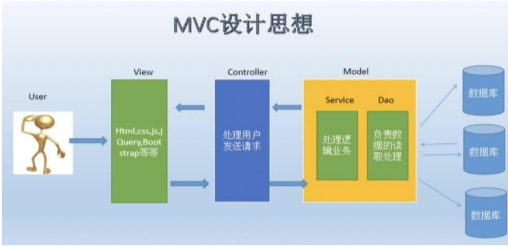
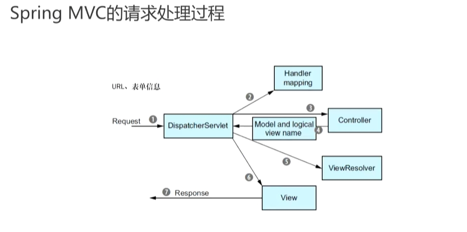

# 1.Spring MVC
1. model-view-controller
2. 模型：存储内容，指数据、领域类
3. 控制器：处理用户输入
4. 视图：显示内容（常用HTML）

# 2.Spring MVC的请求处理过程

1. 请求经过Servlet后，他根据url与控制器的对应关系（handle mapping）把请求转到相应的控制器。控制器拿到请求和请求的参数，会转到业务层进行处理。业务层在数据处理的过程中可能做数据的持久化，把结果返回控制器层。控制器拿到数据后，把结果回退到Servlet上。Servlet拿到逻辑视图名，找到对应的视图解析器的第三方库，做视图的渲染，之后将渲染结果返回浏览器端。
# 3.lombok
1. 依赖
    - 版本包含在父类`spring-boot-starter`的依赖包里，无需指定版本号
```xml
<dependency>
    <groupId>org.projectlombok</groupId>
    <artifactId>lombok</artifactId>
</dependency>
```
2. 简化java代码的编写，比如@Data、@SIF4j注解
  - SIF4j是一个日志的规范，定义了不同的api，可以被不同的第三方log实现
3. 在编译之前介入，生成相应代码
4. 发行的时候需要排除
```xml
<!-- tag::excludeLombok[] -->
  <build>
    <plugins>
      <plugin>
        <groupId>org.springframework.boot</groupId>
        <artifactId>spring-boot-maven-plugin</artifactId>
        <configuration>
          <excludes>
            <exclude>
              <groupId>org.projectlombok</groupId>
              <artifactId>lombok</artifactId>
            </exclude>
          </excludes>
        </configuration>
      </plugin>
    </plugins>
  </build>
  <!-- end::excludeLombok[] -->
```
1. 需要Lombok插件来让idea理解你代码注释的内容
# 4.控制器实现
1. @RequestMapping("/design")
    - 处理以design为前缀的请求
2. @Controller
    - 让Spring知道这是一个控制类，实例化这个类
3. @GetMapping
    - 处理来自浏览器的get请求
    - 浏览器可以发送get、post等请求
    - @RequsetMapping
    - @GetMapping（得到资源）
    - @PostMapping（客户端提交数据或创建新的资源）
    - @DeleteMapping（删除资源）
    - @PutMapping（更新资源）
    - @PatchMapping
```java
@GetMapping
public String showDesignForm() {
    return "design";
}
// design:逻辑视图名
// mvc会基于返回的字符串匹配页面的模板（resources/templates）
// 模板中有待处理的数据，通过th命名空间指定不同的属性，以生成浏览器展示的页面，这个过程叫渲染
// 渲染也是由mvc调用第三方的工具包完成的，依赖如下（同样无需版本号）
<!-- tag::thymeleafStarter[] -->
<dependency>
    <groupId>org.springframework.boot</groupId>
    <artifactId>spring-boot-starter-thymeleaf</artifactId>
</dependency>
<!-- end::thymeleafStarter[] -->
```
# 5.模板、thymeleaf
1. 示例代码
```html
<input th:field="*{ingredients}" type="checkbox" 
        th:value="${ingredient.id}"/>
<span th:text="${ingredient.name}">INGREDIENT</span><br/>
<!-- 生成input元素，通过th的属性来告诉他 -->
<!-- 这里用到了ingredients对象，它是一个request对象 -->
<!-- Servlet规范，Web容器（如Tomcat、Jetty）的实现规范 -->
<!-- 容器中放的是Servlet对象，即处理请求的最小单位 -->
<!-- Servlet对象处理请求会设计到两个概念：request和response -->
<!-- 这两个对象中可以带许多属性：key-value数据结构 -->
<!-- 传进来的request对象针对模板渲染出浏览器页面 -->
```
1. request的属性
```java
@ModelAttribute
public void addIngredientsToModel(Model model) {
	List<Ingredient> ingredients = Arrays.asList(
	  new Ingredient("FLTO", "Flour Tortilla", Type.WRAP),
	  new Ingredient("COTO", "Corn Tortilla", Type.WRAP),
	  new Ingredient("GRBF", "Ground Beef", Type.PROTEIN),
	  new Ingredient("CARN", "Carnitas", Type.PROTEIN),
	  new Ingredient("TMTO", "Diced Tomatoes", Type.VEGGIES),
	  new Ingredient("LETC", "Lettuce", Type.VEGGIES),
	  new Ingredient("CHED", "Cheddar", Type.CHEESE),
	  new Ingredient("JACK", "Monterrey Jack", Type.CHEESE),
	  new Ingredient("SLSA", "Salsa", Type.SAUCE),
	  new Ingredient("SRCR", "Sour Cream", Type.SAUCE)
	);

	Type[] types = Ingredient.Type.values();
	for (Type type : types) {
	  model.addAttribute(type.toString().toLowerCase(),
	      filterByType(ingredients, type));
	}
    // 五个类型，五组key，key对应的value是一个迭代器（filterByType的返回值）
}


@ModelAttribute(name = "tacoOrder")
  public TacoOrder order() {
    return new TacoOrder();
}
// key为tacoOrder，value是TacoOrder这个对象

// 以上的对象会在Spring的model中建立，这些对象可以在@GetMapping方法中被用到，也可以在渲染也被中被使用
```
```html
<input type="text" th:field="*{name}"/>
<!-- 使用了上面创建的Taco对象的name -->
<!-- end::all[] -->
<span class="validationError"
    th:if="${#fields.hasErrors('name')}"
    th:errors="*{name}">Name Error</span>
<!-- tag::all[] -->
<br/>
```
3. @SessionAttributes("tacoOrder")
    - 一次对话，多次请求
    - 让tacoOrder这个对象在一次会话中一直保存着

# 6.处理表单提交
```html
<form method="POST" th:object="${taco}">
<!-- 表单提交后会向服务端发送一个post请求，如果没有指定url，则仍然是当前的url -->
```
```java
@PostMapping
public String processTaco(
    // 根据提交的表单，Spring会生成一个Taco对象
	@Valid Taco taco, Errors errors,
    // 拿到一次会话创建的tacoOrder对象
	@ModelAttribute TacoOrder tacoOrder) {

    if (errors.hasErrors()) {
      return "design";
    }

    tacoOrder.addTaco(taco);
    // log对象建立：private static final org.slf4j.Logger log = org.slf4j.LoggerFactory.getLogger(DesignTacoController.class)
    // 也可以使用lombok的@Slf4j注解
    log.info("Processing taco: {}", taco);
    // 返回重定向的请求
    // 然后浏览器重新向这个url发起请求
    return "redirect:/orders/current";
}
```
```java
// 如何生成taco对象？
// name可以直接带入，而表单给出的ingredients是字符串的列表，如何转化为Ingredient对象的列表
// Spring会在上下文中找转换器
public class IngredientByIdConverter implements Converter<String, Ingredient> {

  private Map<String, Ingredient> ingredientMap = new HashMap<>();
  
  public IngredientByIdConverter() {
    ingredientMap.put("FLTO", 
        new Ingredient("FLTO", "Flour Tortilla", Type.WRAP));
    ingredientMap.put("COTO", 
        new Ingredient("COTO", "Corn Tortilla", Type.WRAP));
    ingredientMap.put("GRBF", 
        new Ingredient("GRBF", "Ground Beef", Type.PROTEIN));
    ingredientMap.put("CARN", 
        new Ingredient("CARN", "Carnitas", Type.PROTEIN));
    ingredientMap.put("TMTO", 
        new Ingredient("TMTO", "Diced Tomatoes", Type.VEGGIES));
    ingredientMap.put("LETC", 
        new Ingredient("LETC", "Lettuce", Type.VEGGIES));
    ingredientMap.put("CHED", 
        new Ingredient("CHED", "Cheddar", Type.CHEESE));
    ingredientMap.put("JACK", 
        new Ingredient("JACK", "Monterrey Jack", Type.CHEESE));
    ingredientMap.put("SLSA", 
        new Ingredient("SLSA", "Salsa", Type.SAUCE));
    ingredientMap.put("SRCR", 
        new Ingredient("SRCR", "Sour Cream", Type.SAUCE));
  }
  
  @Override
  public Ingredient convert(String id) {
    return ingredientMap.get(id);
  }

}
```
# 7.校验表单输入
1. JavaBean Validation API
    - 有关验证规范的api
    - 可能被很多第三方实现
2. spring-boot-starter-validation（有Hibernate针对JavaBean Validation API的实现）
3. 领域类上添加校验规则
```java
public class Taco {
  @NotNull
  @Size(min=5, message="Name must be at least 5 characters long")
  private String name;

  @NotNull
  @Size(min=1, message="You must choose at least 1 ingredient")
  private List<Ingredient> ingredients;
}
```
4. 控制器中声明校验：@Valid
    - 见上
5. 修改表单视图以展现校验错误
```html
<span class="validationError"
    th:if="${#fields.hasErrors('ingredients')}"
    th:errors="*{ingredients}">Ingredient Error</span>
```
# 8.视图控制器（View Controller）
```java
@Configuration
// 实现相应的接口方法
public class WebConfig implements WebMvcConfigurer {

  @Override
  public void addViewControllers(ViewControllerRegistry registry) {
    // 如果是home路径，就返回home视图->视图控制器
    registry.addViewController("/").setViewName("home");
  }

}
```
# 9.缓存模板
1. 为了避免重复的加载，一般我们在第一次加载的时候，我们会把它缓存起来
2. Spring默认有缓存能力
3. 可以在.yml文件或.properties文件中进行配置
# 10.参数
1. 表单参数、路径参数和请求参数
```java
// /lotto/5
@GetMapping(value = "/lotto/{id}, produces = "application/json")
// 路径参数，通过@PathVariable注解获得
public String lotto(@PathVariable("id") long id) throws IOException {
    File file = ResourceUtils.getFile("classpath:lotto.json");
    return new String(File.readAllBytes(file.toPath));
}

// 问号分割，后边很多key-value，称之为请求参数
// localhost:8080/challenge?mode=2&id=1223234232
// 通过@RequestParam注解获得
@GetMapping(value = "/challenge", produces = "application/json")
@ResponseStatus(HttpStatus.CREATED)
public Map<String, Object> challenge(
    @RequestParam("mode") String mode,
    @RequestParam("id") String id) throw IOException {
        Map<String, Object> result = new HashMap<>();
        result.put("mode", mode);
        result.put("id", id);
        return result;
    }
```
2. json请求体
@RequestBody注解获得，会用到HttpMessageConverter消息转换器，把json串转为java对象