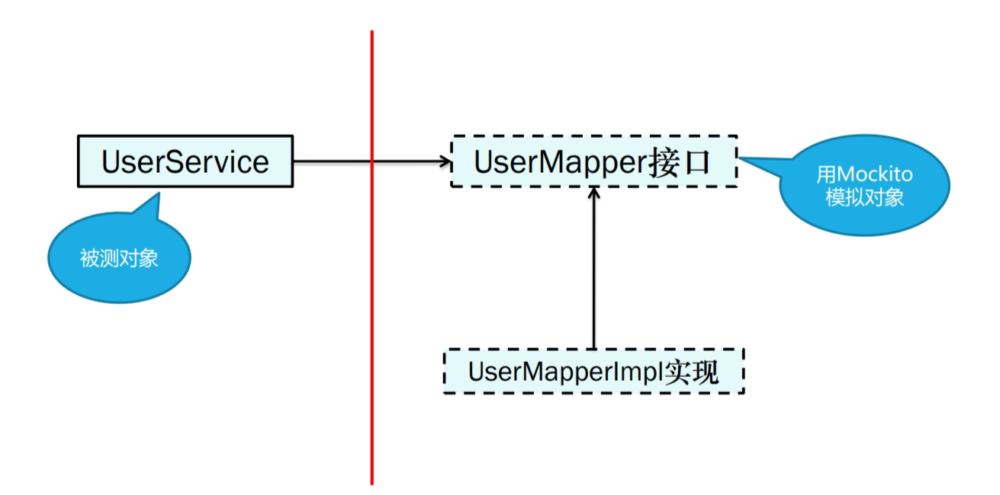

[toc]
# 1.数据库访问
1. 数据库访问的技术很多，实现细节很多
2. 让这些访问技术都实现一个公共的接口，这样业务层就只与接口打交道，而不用考虑具体的实现细节
```java
public interface IngredientRepository {

  Iterable<Ingredient> findAll();
  
  Optional<Ingredient> findById(String id);
  
  Ingredient save(Ingredient ingredient);
  
}
```
# 2.接口实现
1. 使用原始的JDBC访问数据库
```java
@Override
public Iterable<Ingredient> findAll() {
    List<Ingredient> ingredients = new ArrayList<>();
    Connection connection = null;
    PreparedStatement statement = null;
    ResultSet resultSet = null;
    try {
      connection = dataSource.getConnection();
      statement = connection.prepareStatement(
          "select id, name, type from Ingredient");
      resultSet = statement.executeQuery();
      while(resultSet.next()) {
        Ingredient ingredient = new Ingredient(
            resultSet.getString("id"),
            resultSet.getString("name"),
            Ingredient.Type.valueOf(resultSet.getString("type")));
        ingredients.add(ingredient);
      }
    } catch (SQLException e) {
      // ??? What should be done here ???
    } finally {
      if (resultSet != null) {
        try {
          resultSet.close();
        } catch (SQLException e) {}
      }
      if (statement != null) {
        try {
          statement.close();
        } catch (SQLException e) {}
      }
      if (connection != null) {
        try {
          connection.close();
        } catch (SQLException e) {}
      }
    }
    return ingredients;
}
```
2. 以上代码就主要两点：
    - 执行什么语句
    - 将结果转为java对象
    - 其余为样板式的操作
        - ResultSet、PreparedStatement、Connection
    - 使用模板框架来简化代码
3. SQLException：checked异常
    - 编译器要求必须try——catch
4. 异常体系
    1. SQLException
        - 发生异常很难恢复
        - 难以确定异常类型
    2. Hibernate异常
        - 定义了许多具体异常，方便定位问题
        - 对业务对象的侵入
    3. Spring所提供的平台无关的持久化异常
        - DataAccessException
          - 屏蔽底层异常，它是运行期异常，可抓可不抓
          - 和数据库实现细节解耦
        - 具体异常，方便定位问题
        - 隔离具体数据库平台
5. 使用JdbcTemplate
```java
private JdbcTemplate jdbcTemplate;

// @Autowired
// JdbcTemplate对象:spring会自动创建
public JdbcIngredientRepository(JdbcTemplate jdbcTemplate) {
    this.jdbcTemplate = jdbcTemplate;
}

@Override
public Iterable<Ingredient> findAll() {
    return jdbcTemplate.query(
        "select id, name, type from Ingredient",
        this::mapRowToIngredient);
}
```
```xml
<!-- tag::springJdbcTemplate[] -->
<dependency>
    <groupId>org.springframework.boot</groupId>
    <artifactId>spring-boot-starter-jdbc</artifactId>
</dependency>
<!-- end::springJdbcTemplate[] -->

<!-- 使用h2内存数据库 -->
<!-- tag::h2database[] -->
<dependency>
    <groupId>com.h2database</groupId>
    <artifactId>h2</artifactId>
    <scope>runtime</scope>
</dependency>
<!-- end::h2database[] -->
```
6. 如何在h2数据库中创建表
    - 通过一个`schema.sql`文件
    - spring会在根目录下找这个文件，并自动创建表
    - 通过`data.sql`文件执行数据库的初始化
7. 如果使用MySQL数据库
    - spring会在属性文件中寻找相关信息
    - 比如数据库名，密码
    - 接下来执行`schema.sql`和`data.sql`
8. 主要我们的接口实现都加了`@Repository`注解，功能类似@Component
# 3.业务层使用接口
```java
private final IngredientRepository ingredientRepo;

@Autowired
public DesignTacoController(
    IngredientRepository ingredientRepo) {
    this.ingredientRepo = ingredientRepo;
}

@ModelAttribute
public void addIngredientsToModel(Model model) {
    Iterable<Ingredient> ingredients = ingredientRepo.findAll();
    Type[] types = Ingredient.Type.values();
    for (Type type : types) {
      model.addAttribute(type.toString().toLowerCase(),
          filterByType(ingredients, type));
    }
}
```
# 4.save(TacoOrder order)的实现
1. Taco不能脱离TacoOrder而存在，聚合关系
2. JdbcOrderRepository
3. identity字段由数据库自动生成值，获取返回的ID，GeneratedKeyHolder
    - PreparedStatementCreatorFactory
    - PreparedStatementCreator
    - jdbcOperations.update
4. 注入OrderController，使用
# 5.h2访问
1. 配置生成的H2数据库名，用于console访问
```yml
spring:
    datasource:
        generate-unique-name: false
        name: tacocloud #数据库名字
```
2. 依赖
```xml
<dependency>
    <groupId>org.springframework.boot</groupId>
    <artifactId>spring-boot-devtools</artifactId>
    <scope>runtime</scope>
</dependency>
```
3. h2访问
    - http://localhost:8080/h2-console
    - 驱动：org.h2.Driver
    - JDBC URL：jdbc:h2:mem:tacocloud
    - 用户名：sa
# 6.Spring Data项目
1. Spring Data JDBC
2. Spring Data JPA
3. Spring Data MongoDB
4. Spring Data Neo4j
5. Spring Data Redis
6. Spring Data Cassandra
# 7.Spring Data JDBC
1. 依赖
```xml
<dependency>
    <groupId>org.springframework.boot</groupId>
    <artifactId>spring-boot-starter-data-jdbc</artifactId>
</dependency>
```
2. 定义持久化接口
```java
import org.springframework.data.repository.CrudRepository;
public interface IngredientRepository 
    extends CrudRepository<Ingredient, String> {}
// Ingredient是表，string是指id的类型
```
3. 为领域类添加持久化的注解
    - @Table，对象会基于领域类的名称映射到数据库的表上
        - TacoOrder会映射到Taco_Order表（对于这种驼峰式的命名）
    - @Id
    - @Column
        - deliveryName会映射到delivery_Name列
        - 没有指定默认映射同名
4. 程序预加载
    - 没有`data.sql`文件如何初始化表
    - 两个接口方法
    - org.springframework.boot.CommandLineRunner
    - org.springframework.boot.ApplicationRunner
```java
@Bean
public CommandLineRunner dataLoader(IngredientRepository repo) {
    return args -> {
      repo.deleteAll(); // TODO: Quick hack to avoid tests from stepping on each other with constraint violations
      repo.save(new Ingredient("FLTO", "Flour Tortilla", Type.WRAP));
      repo.save(new Ingredient("COTO", "Corn Tortilla", Type.WRAP));
      repo.save(new Ingredient("GRBF", "Ground Beef", Type.PROTEIN));
      repo.save(new Ingredient("CARN", "Carnitas", Type.PROTEIN));
      repo.save(new Ingredient("TMTO", "Diced Tomatoes", Type.VEGGIES));
      repo.save(new Ingredient("LETC", "Lettuce", Type.VEGGIES));
      repo.save(new Ingredient("CHED", "Cheddar", Type.CHEESE));
      repo.save(new Ingredient("JACK", "Monterrey Jack", Type.CHEESE));
      repo.save(new Ingredient("SLSA", "Salsa", Type.SAUCE));
      repo.save(new Ingredient("SRCR", "Sour Cream", Type.SAUCE));
    };
}
```
# 8.Spring Data JPA
1. 介绍
    - JPA：Java Persistence API
    - JPA的宗旨是为POJO提供持久化标准规范
    - JPQL是一种面向对象的查询语言
    - 依赖
```xml
<dependency>
    <groupId>org.springframework.boot</groupId>
    <artifactId>spring-boot-starter-data-jpa</artifactId>
</dependency>
```
2. 接口同上不用变
3. javax.persistence.*
    1. @Entity
       - 会根据java对象定义自动生成表结构
    2. @Id，@Column
4. @OneToMany，@ManyToMany
    - 一对多，多对多
    - 级联关系
# 9.自定义查询方法
1. 定义查询方法，无需实现
    - 领域特定语言（domain-specific language，DSL），spring data的命名约定
    - 查询动词 + 主题 + 断言
    - 查询动词：get、read、find、count
    - 例子：
        - List<TacoOrder> findByDeliveryZip( String deliveryZip );
2. 声明自定义查询
    - 不符合方法命名约定时，或者命名太长时
    - 使用@Query注解
    - @Query(“Order o where o.deliveryCity = 'Seattle'”)
    - List<TacoOrder> readOrdersDeliveredInSeattle( );
  
# 复习
1. 基于接口交互的两种好处
    - 便于我们对业务层代码或数据库访问层进行测试
      - 我们可以通过mockito来进行测试，而不需要真正实现DAO层的接口
      - 
    - 业务层看到的永远是一个接口，我们可以灵活的选择DAO层的实现，而不用改变业务层代码
2. 三种实现方式的区别
    - 第一种、第二种需要提供`schema.sql`脚本定义一些表结构
    - 第三种可以根据java对象自动生成表结构
    - 第二、第三种大多数情况不需要提供接口实现，只要提供接口
    - 从领域对象来看，第二、第三种要对领域对象加注解，提供和数据库表结构的对应关系
      - 第二种是spring实现的，加的是@Table
      - 第三种是jpa规范，加的是@Entity，包路径为`javax.persistence.*`
    - 第二、第三种都有@Query注解，但第三种更灵活，它有特定领域语言（DSL），基于方法的命名规则，表达意图
    - 第一种是数据库自动生成的id，要通过GeneratedKeyHolder的方式获取返回的id，再注入领域类。第二、第三种就不用操心id的值了
3. 数据库初始化的三种方式
    - data.sql
    - CommandLineRunner接口
    - ApplicationRunner接口
4. CrudRepository是一个父类接口