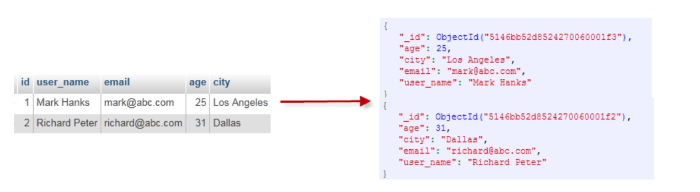

# NoSQL
MongoDB与Redis
# 1.MongoDB
1. 文档数据库、分布式存储、C++编写
2. 文档一般以**类json格式**存储
3. 客户端MongoDB Shell
## 1.1MongoDB概念
|SQL概念|MongoDB概念|解释/说明|
|--|--|--|
database| database|数据库
table| collection|数据库表/集合
row| document|数据记录行/文档
column| field|数据字段/域


## 1.2MongoDB简单使用
1. 在docker中使用mongoDB
```sh
# 拉取镜像
docker pull mongo:latest
# 创建网络
docker network create mongo-net
# 启动server，默认端口号27017
docker run --name my-mongo --network mongo-net -p 27017:27017 -d mongo:latest
# 启动客户端
docker run -it --network mongo-net --rm mongo mongosh --host my-mongo
```
```sh
show dbs
db
db.somthing.insertOne({x:10})
db.somthing.find()
show collections
db.createCollection("person")
db.person.find()
```
## 1.3spring中使用mongoDB
1. 依赖
```xml
<!-- tag::springDataMongoDb[] -->
<dependency>
    <groupId>org.springframework.boot</groupId>
    <artifactId>
    spring-boot-starter-data-mongodb
    </artifactId>
</dependency>
<!-- end::springDataMongoDb[] -->
```
### 1.3.1通过客户端访问
```java
import com.mongodb.client.*;
import com.mongodb.client.model.Filters;
import org.bson.Document;

import java.util.ArrayList;
import java.util.List;
public class MongoDBClient {
    public static void main(String args[]) {
        try {
            // 使用无参的create()方法，默认访问本机的
            MongoClient mongoClient = MongoClients.create();
            // 如果没有test数据库，会自动创建
            MongoDatabase mongoDatabase = mongoClient.getDatabase("test");
            // 获得collection
            MongoCollection<Document> collection = mongoDatabase.getCollection("mytable");
            // 删除
            collection.deleteMany(Filters.eq("name", "taozs"));

            //插入
            Document document = new Document("name", "taozs").
                    append("age", 18).
                    append("memo", "taozhaosheng");
//          collection.insertOne(document);
            // 批量插入
            List<Document> documents = new ArrayList<>();
            documents.add(document);
            collection.insertMany(documents);

            //删除符合条件的第一个文档
//            collection.deleteOne(Filters.eq("age", 18));

            //删除所有符合条件的文档
//            collection.deleteMany(Filters.eq("age", 18));

            //查询
            FindIterable<Document> findIterable = collection.find();

            MongoCursor<Document> mongoCursor = findIterable.iterator();
            while (mongoCursor.hasNext()) {
                Document doc =mongoCursor.next();
                System.out.println(doc);
                System.out.println(doc.toJson());
            }

            mongoClient.close();

        } catch (Exception e) {
            System.err.println(e.getClass().getName() + ": " + e.getMessage());
        }
    }
}
```
### 1.3.2基于spring data
1. 同jpa相同的接口定义
```java
public interface OrderRepository 
         extends CrudRepository<TacoOrder, String> {}
```

2. 数据库连接配置：配置文件`application.properties`中加入`spring.data.mongodb.uri=mongodb://localhost:27017/test`
    - 在此进行配置
    3.对领域对象加上不同的注解
```java
@Document
@Id // 一般在mongoDB中使用string类型

// 在taco类中没有加document注解
// tacoOrder通过三个对象（tacoOrder，taco，Ingredient）的信息来构建文档
// 可能存在信息重复存储的问题，MongoDB也能解决
```
## 1.4批量插入性能对比
两种方式的性能差不多
插入内容对比：

# 2.Redis
1. 内存数据库（做缓存）
2. 可以进行数据持久化
3. 集群化部署
4. 存储最小单位：key-value（区分大小写）
## 2.1Redis命令
1. redis-server
    - Redis配置：redis.conf
    - 默认端口号6379
2. 客户端：redis-cli
3. Redis数据类型
    - key一般是String类型
    - 指的是value类型
      - String
      - List
      - Hash
      - Set
4. 在docker中使用redis
```sh
# 拉取镜像
docker pull redis:latest
# 创建网络
docker network create redis-net
# 启动server，默认端口号6379
docker run --name my-redis --network redis-net -p 6379:6379 -d redis:latest
# 启动客户端
docker run -it --network redis-net --rm redis redis-cli -h my-redis
```
5. 简单命令
```sh
info
select 5 # 切换到索引为5的数据库，默认打开是0
set key value # 插入
get key # 得到
incr key # 递增整型值
incr key 50 # 加50
exists key # 查看key是否存在
del key
keys * # 查看已有的key
expire key 15 # 让key存活15秒

lpush mylist a b c d # 从左边开始插：d, c, b, a
rpush mylist 1 2 3 4 # 从右边开始插：1, 2, 3, 4
lrange mylist 0 -1 # 查看列表（-1为列表最后一个元素）
rpop mylist # 弹出一个元素

hmset user name tao age 10 # value也是由一系列key-value组成
hgetall user
type user

sadd myset 1 2 3 a b c
smembers myset
```
## 2.2spring中使用redis
1. 客户端Jedis和Lettuce
    - Jedis和Lettuce都是连接Redis Server的客户端程序
    - RedisConnectionFactory接口，JedisConnectionFactory
    - SpringBoot2.x 后默认使用的不再是Jedis而是lettuce，所以spring-boot-starter-data-redis依赖了：lettuce-core、spring-data-redis、spring-boot-starter
    - RedisConnectionFactory接口实现自动生成在上下文中，可直接注入使用
2. 代码
```java
@SpringBootApplication
public class DemoApplication {

    public static void main(String[] args) {
        SpringApplication.run(DemoApplication.class, args);
    }

    @Bean
    // 两个类型参数，一个是key的类型，一个value的类型（简单来看）
    public RedisTemplate<String, Product> redisTemplate(RedisConnectionFactory cf) { // 自动生成的cf
        RedisTemplate<String, Product> redis = new RedisTemplate<>();
        redis.setConnectionFactory(cf);
        return redis;
    }
}
```
3. 属性文件中配置redis信息，spring根据这些信息创建RedisConnectFactory对象
```
spring.redis.timeout=10000

spring.redis.host=localhost
spring.redis.port=6379
```
4. 访问数据库
```java
// 单个元素
Product product = new Product();
product.setSku("9781617291203");
product.setName("Spring in Action");
product.setPrice(39.99f);

redisTemplate.opsForValue().set(product.getSku(), product);
// product在数据库里是string类型——通过序列化
// 对象必须具有序列化的能力才能存进数据库


// 列表
Product product1 = new Product();
product1.setSku("9781617291203");
product1.setName("Spring in Action");
product1.setPrice(39.99f);

Product product2 = new Product();
product2.setSku("9781935182436");
product2.setName("Spring Integration in Action");
product2.setPrice(49.99f);

Product product3 = new Product();
product3.setSku("9781935182955");
product3.setName("Spring Batch in Action");
product3.setPrice(49.99f);

redisTemplate.opsForList().rightPush("cart", product1);
redisTemplate.opsForList().rightPush("cart", product2);
redisTemplate.opsForList().rightPush("cart", product3);


// 集合
Product product = new Product();
product.setSku("9781617291203");
product.setName("Spring in Action");
product.setPrice(39.99f);
redisTemplate.opsForSet().add("cart", product);

// 集合操作
Set<Product> diff = redisTemplate.opsForSet().difference("cart1", "cart2");
Set<Product> union = redisTemplate.opsForSet().union("cart1", "cart2");
Set<Product> isect = redisTemplate.opsForSet().intersect("cart1", "cart2");

// 绑定key
BoundListOperations<String, Product> cart = redisTemplate.boundListOps("cart");
cart.rightPush(product1);
cart.rightPush(product2);
cart.rightPush(product3);
```
5. 序列化接口
```java
import java.io.Serializable;
public class Product implements Serializable {
    ...
}
```
6. 指定json序列化
```java
// need a local version so we can tweak the serializer
RedisTemplate<String, Product> redis = new RedisTemplate<>();
redis.setConnectionFactory(cf);

redis.setKeySerializer(new StringRedisSerializer());
redis.setValueSerializer(new Jackson2JsonRedisSerializer<Product>(Product.class));
redis.afterPropertiesSet(); // if this were declared as a bean, you wouldn't have to do this


// 获得json格式串而非java对象
StringRedisTemplate stringRedis = new StringRedisTemplate(cf);
String json = stringRedis.opsForValue().get(product.getSku());
```

## 复习
1. MongoDB的文档不必具有相同的域/字段
2. @Document注解是与MongoDB依赖绑定的，而@Id不是的
3. Redis默认数据库有16个，编号从0到15
4. MongoDB无需序列化，Redis需要序列化
5. 添加以下依赖可以在创建MongoDB内存数据库
```xml
<!-- tag::flapDoodle[] -->
<dependency>
    <groupId>de.flapdoodle.embed</groupId>
    <artifactId>de.flapdoodle.embed.mongo</artifactId>
</dependency>
<!-- end::flapDoodle[] -->
```