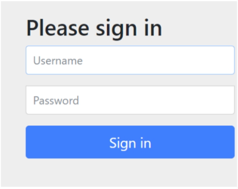
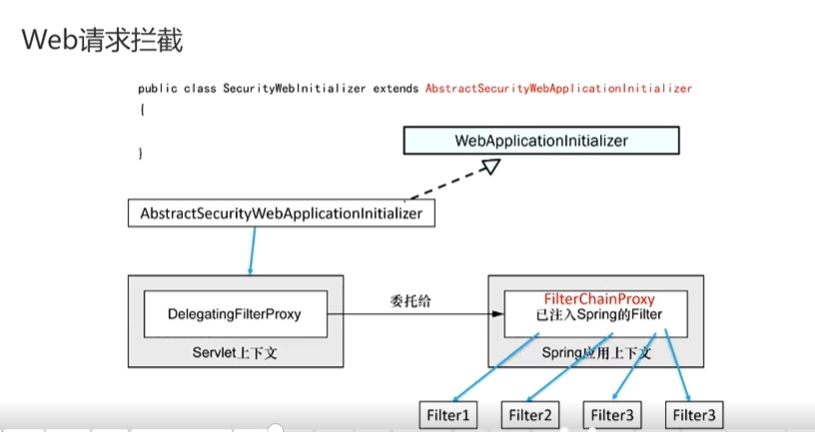
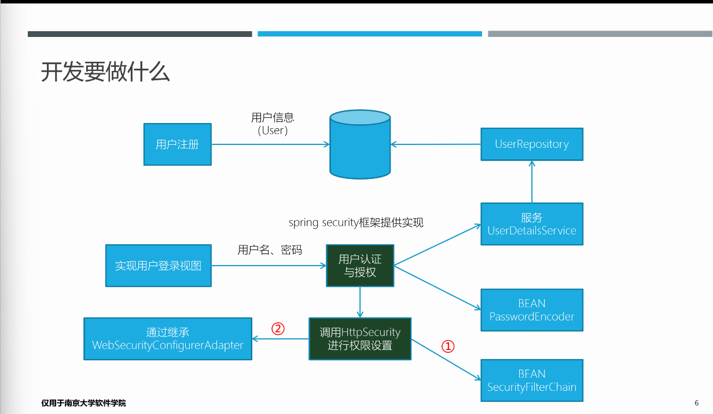
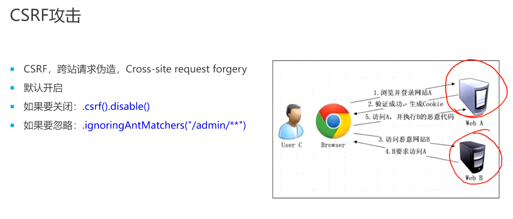

[toc]
# Spring Security
JAAS：java底层的安全框架
## 1.依赖
1. spring简化了java开发，springboot简化了spring开发
2. spring-boot的starter依赖
3. 为什么下面依赖不用指定版本号——在<parent></parent>中看
    - springboot版本帮我管理第三方包的版本
```xml
<!-- Spring Security -->
<dependency>
    <groupId>org.springframework.boot</groupId>
    <artifactId>spring-boot-starter-security</artifactId>
</dependency>
```
1. 加入以上依赖会自动获得登陆界面

    - 默认用户名user
    - 密码查看日志获得
## 2.Cookie——维持客户端服务端之间较长的会话
1. 客户端发送design请求，客户端返回302状态码，要让客户端重定向
2. 客户端收到respond后，在向客户端发送login请求（重定向）
3. 客户端登录成功后，服务端返回302状态码（重定向），让客户端访问最初请求的url。重点是服务端的respond包含Set-Cookie，里边包含JSESSIONID，客户端把它存下来，之后再次进行请求时，客户端会在请求头部带上这个信息，服务端通过校验来判断请求是否来自同一用户。
    - 让你在通过一次spring安全认证后，后续不用再认证
    - 你得到了JSESSIONID，也可以在其他客户端进行访问来骗过服务端，服务端只认这个信息
## 3.Web请求拦截
1. Spring的一些背后逻辑其实来自于servlet规范
2. 请求到服务端会经过一系列的过滤器（Filter），过滤器可以放行请求，也可以拦截请求。用户的认证就是被某一些Filter拦截带来的效果

## 4.开发做什么

蓝色需要我们自己做
绿色springboot已经实现
我们实现接口，springboot来调用到这个接口
1. 用户注册存储
```java
// 实现接口，返回UserDetails
@Bean
public UserDetailsService userDetailsService(UserRepository userRepo) {
    return username -> {
      User user = userRepo.findByUsername(username);
      if (user != null) {
        return user;
      }
      throw new UsernameNotFoundException(
                      "User '" + username + "' not found");
    };
}

// 访问数据库的接口
public interface UserRepository extends CrudRepository<User, Long> {
  User findByUsername(String username);
}

// User的领域类
public class User implements UserDetails {

  private static final long serialVersionUID = 1L;

  @Id
  @GeneratedValue(strategy=GenerationType.AUTO)
  private Long id;
  
  private final String username;
  private final String password;
  private final String fullname;
  private final String street;
  private final String city;
  private final String state;
  private final String zip;
  private final String phoneNumber;
  
  // 获得当前用户的权限
  @Override
  public Collection<? extends GrantedAuthority> getAuthorities() {
    return Arrays.asList(new SimpleGrantedAuthority("ROLE_USER"));
    // 归属于USER角色，有ROLE_USER权限
  }

  @Override
  public boolean isAccountNonExpired() {
    return true;
  }

  @Override
  public boolean isAccountNonLocked() {
    return true;
  }

  @Override
  public boolean isCredentialsNonExpired() {
    return true;
  }

  @Override
  public boolean isEnabled() {
    return true;
  }
}
// 写一个注册控制器和注册页面将用户信息放入数据库
```
2. 密码加密（见下）
3. 用户登录页面（见下）
    - 只需要写页面，包含用户名和密码，其他spring会帮你做
4. 权限设定（见下）
    - 通过Filter
## 5.密码转码器
1. 真实场景中密码不能以明文存储
2. 方法
    - NoOpPasswordEncoder：不编码密码，而保持明文，因为它不会对密码进行哈希化，所以永远不要在真实场景中使用它
    - StandardPasswordEncoder：使用SHA-256对密码进行哈希化。这个实现现在已经不推荐了，不应该在新的实现中使用它
    - Pbkdf2PasswordEncoder：使用基于密码的密钥派生函数2（PBKDF2）
    - BCryptPasswordEncoder：使用bcrypt强哈希函数对密码进行编码
    - SCryptPasswordEncoder：使用scrypt强哈希函数对密码进行编
3. 使用
```java
// 只要把这个对象new出来，spring会在适当的时机使用这个对象
@Bean
public PasswordEncoder encoder() {
    return new BCryptPasswordEncoder();
} 
```
## 6.用户登录页面
1. login与logout背后处理的控制器不需要自己实现
```java
@Override
public void addViewControllers(ViewControllerRegistry registry) {
    registry.addViewController("/").setViewName("home");
    registry.addViewController("/login");
}
```
1. 相关的spring配置，对web请求做权限控制
```java
@Bean
// http对象上下文会有，自动注入
public SecurityFilterChain filterChain(HttpSecurity http) throws Exception {
    return http
      .authorizeRequests()
        .mvcMatchers("/design", "/orders").hasRole("USER") // 经过认证的且属于USER角色的用户才能访问这两个url
        .anyRequest().permitAll() // 其他url都放行，要放在后边（先具体后一般）

      .and() // 获得http的引用
        .formLogin()
          .loginPage("/login")  // 覆盖默认的login页面
          
      .and()
        .logout()
          .logoutSuccessUrl("/")
          
      // Make H2-Console non-secured; for debug purposes
      .and()
        .csrf()
          .ignoringAntMatchers("/h2-console/**")
  
      // Allow pages to be loaded in frames from the same origin; needed for H2-Console
      .and()  
        .headers()
          .frameOptions()
            .sameOrigin()
            
       .and()
       .build();
}
```
1. login页面提交的表单需要包含用户名（username）和密码（password）
    - 如果你不想使用username和password这样的名字，可以使用如下方法
```java
.and() // 获得http的引用
    .formLogin()
        .loginPage("/login")  // 覆盖默认的login页面
        .usernameParameter("user")
        .passwordParameter("password22")
```
## 7.角色和权限
1. 对角色加上ROLE前缀，就成为一个权限
    - ROLE_USER
## 8.CSRF（跨站请求伪造）与CORS（跨站资源共享）
1. 将日志的输出级别调整为debug
    - logging.level.root=debug
      - 所有的内容调整为debug
    - logging.level.org.springframework.security=debug
      - 只调整这个包下的
2. 我们请求design时，服务端发过来的表单带有csrf和对应的值
在提交表单的时候，客户端又把这个字段发给服务端
1. csrf攻击
C首先访问A，建立一个很长时间的会话，然后C访问B，B给C一个表单，这个表单是发给A的，由于C经过了A的认证，所以认为C的请求都是合法的，导致A可能执行来自B的恶意代码
2中的行为就是为了防止csrf攻击

1. 关闭csrf
```java
.and()
    .csrf()
        .ignoringAntMatchers("/h2-console/**")
```
## 9.另一种配置
```java
@Configuration
@EnableGlobalMethodSecurity(prePostEnabled = true)
public class SecurityConfig extends WebSecurityConfigurerAdapter {

  @Autowired
  private UserDetailsService userDetailsService;

  @Override
  protected void configure(HttpSecurity http) throws Exception {
    http
      .authorizeRequests()
        .antMatchers("/design", "/orders").access("hasRole('USER')")
        .antMatchers("/", "/**").access("permitAll")

      .and()
        .formLogin()
          .loginPage("/login")

      .and()
        .logout()
          .logoutSuccessUrl("/")

      .and()
      .httpBasic()
      .realmName("tacos")

      // Make H2-Console non-secured; for debug purposes
      .and()
        .csrf()
          .ignoringAntMatchers("/h2-console/**")
//            .ignoringAntMatchers("/admin/**")

      // Allow pages to be loaded in frames from the same origin; needed for H2-Console
      .and()
        .headers()
          .frameOptions()
            .sameOrigin()
      ;
  }

  @Bean
  public PasswordEncoder encoder() {
    return new BCryptPasswordEncoder();
  }
```
## 10.将用户名密码放在内存中
```java
//  @Bean
//  public UserDetailsService userDetailsService(PasswordEncoder encoder) {
//    List<UserDetails> usersList = new ArrayList<>();
//    usersList.add(new User("buzz",encoder.encode("infinity"),Arrays.asList(new SimpleGrantedAuthority("ROLE_USER"))));
//    usersList.add(new User("woody",encoder.encode("bullseye"),Arrays.asList(new SimpleGrantedAuthority("ROLE_USER"))));
//    return new InMemoryUserDetailsManager(usersList);
//  }


// 
// IN MEMORY AUTHENTICATION EXAMPLE
//
/*
  @Override
  protected void configure(AuthenticationManagerBuilder auth)
      throws Exception {

    auth
      .inMemoryAuthentication()
        .withUser("buzz")
          .password("infinity")
          .authorities("ROLE_USER")
        .and()
        .withUser("woody")
          .password("bullseye")
          .authorities("ROLE_USER");

  }
*/
```
## 11.启用HTTP Basic认证（默认关闭）
```java
.and()
  .httpBasic()
    .realName("tacos")
```
Basic认证：可以在请求的头部带上用户名和密码，使用Basic 64加密（公开算法），而无需在登录页面登录
## 12.实现方法级别的安全
```java
@Configuration
@EnableGlobalMethodSecurity
public class SecurityConfig extends WebSecurityConfigAdapter {

  @PreAuthorize("hasRole('ADMIN)")
  //  @PreAuthorize("hasRole('USER')")
  public void deleteAllOrders() {
    orderRepository.deleteAll();
  }
}
```
## 13.获取当前登录的用户
1. DesignTacoController
    - 参数：Principal principal（来自java.security包）
    - String username = principal.getName()
2. OrderController
@Authentication User user（spring提供）
3. 安全上下文获取
Authentication authentication = SecurityContextHolder.getContext().getAuthentication();
User user = (User) authentication.getPrincipal();
## 复习
1. 实现用户登录控制器
2. 请求重定向到用户登录页面
3. 通过Filter对设定的权限进行控制

---
1. 用户信息存储
  - 内存用户存储
  - JDBC用户存储
  - LDAP用户存储

---
1. 创建自定义登录页
  - 当需要认证时转向的登录页：.loginPage("/login")
  - 视图控制器，定义login请求对应的视图：registry.addViewController("login")
  - 登录的post请求由Spring Security自动处理，名称默认：username、password，可配置