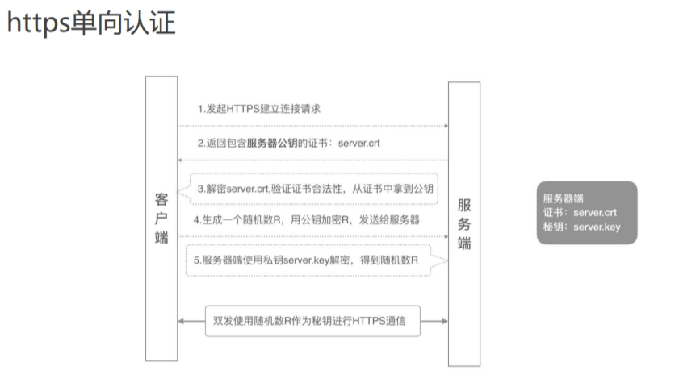
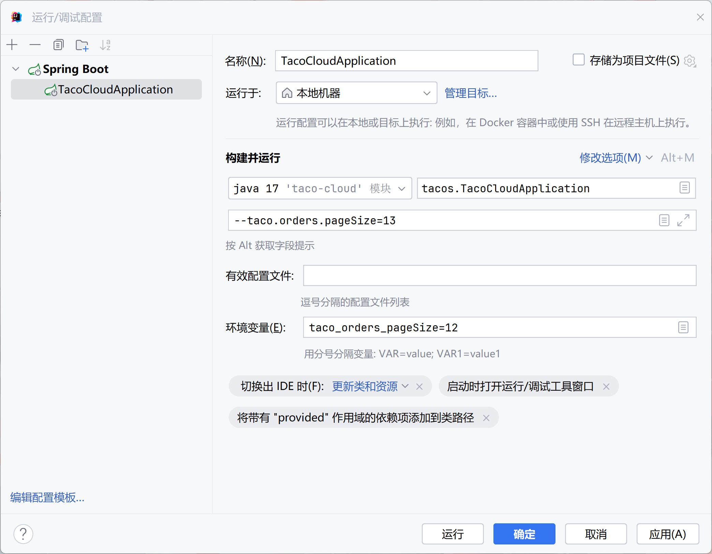
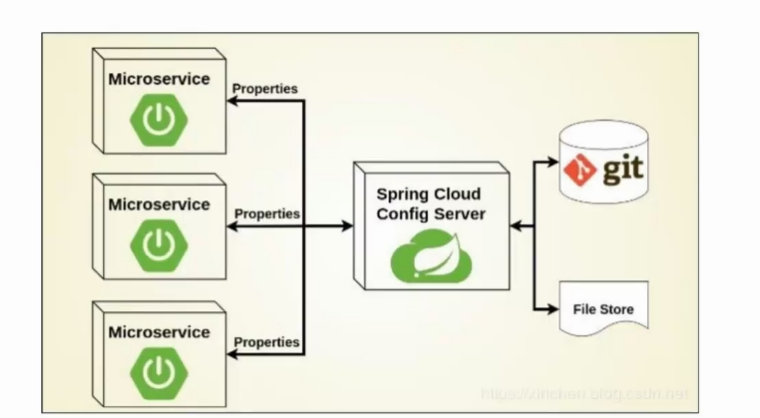

# 配置属性
## 1.属性来源（property source）
1. application.yml/properties属性文件
    - properties文件是key-value类型的
    - yaml文件：层级结构
2. 命令行参数（commandLineArgs）：java -jar taco-cloud-sd-jdbc-0.0.3-SNAPSHOT.jar --server.port=8081
    - 先用mvn进行打包，然后运行jar包
    - mvn clean package "-Dmaven.test.skip=true"
3. JVM系统属性：java -Dserver.port=8091 -jar taco-cloud-sd-jdbc-0.0.3-SNAPSHOT.jar
4. 操作系统环境变量：set SERVER_PORT=8082、java -jar taco-cloud-sd-jdbc-0.0.3-SNAPSHOT.jar
### 1.1YAML文件
1. 使用缩进表示层级关系，不允许使用Tab键，只允许使用空格
2. #表示注释，从这个字符一直到行尾，都会被解析器忽略。
3. 对象，键值对，使用冒号结构表示（冒号后要有空格）
✓ animal: pets
✓ hash: { name: Steve, foo: bar }
1. 数组，一组连词线开头的行，构成一个数组
   - 行内表示法：animal: [Cat, Dog]
```yml
- Cat
- Dog
- Goldfish
```
## 2.配置数据源
```yml
spring:
  datasource:
    driverClassName: "org.h2.Driver"
    url: "jdbc:h2:mem:tacocloud"
    username: sa
    password: 123456
# 修改sql脚本位置
  sql:
    init:
      mode: always
      schema-locations: classpath:schema.sql
      data-locations: classpath:data.sql
```
## 3.建立HTTPS安全通道

1. 连接是安全的：
    - 淘宝的证书是带有权威机构的签名
    - 如何判断来自权威机构
      - OS会存储受信任的根证书
    - 建立连接之后，通信都会用ssl加密
## 4.keytool
1. keytool是jdk自带的一个密钥库管理工具，位于%JAVA_HOME%\bin\keytool.exe，我们可以使用它生成密钥库、管理证书
### 4.1生成密钥库
1. 通过命令生成
    - keytool -genkey -alias tomcat -keyalg RSA -storetype PKCS12 -storepass letmein -keystore mykeys.p12
    - key的名字命名为tomcat
    - 使用RSA加密算法
    - store库的格式类型：PKCS12
    - keystore口令：letmein
    - 最后是文件名
2. 密钥库类型：PKCS12
3. 查看密钥库
    - keytool -list -keystore mykeys.p12 -storepass letmain
### 4.2密钥库类型：PKCS12
1. 格式：PKCS12，Public Key Cryptography Standards #12
2. 扩展名：.p12/.pfx
3. 描述：【PKCS #12】个人信息交换语法标准
4. 特点：
  - 1.包含私钥、公钥及其证书
  - 2.密钥库和私钥用相同密码进行保护

### 4.3配置SSL
```yml
# 默认为8443
server:
  port: 8443
  ssl:
    key-store: classpath:mykeys.p12
    key-store-password: letmein
    key-password: letmein
```
## 5.日志配置
1. Spring Boot默认使用Logback，日志配置文件logback.xml
2. 默认日志级别：INFO
3. 日志配置（application.yml）
```yml
logging:
  level:
    root: WARN
    # org:
    #   Springframework:
    #     security: DEBUG
    org.springframework.security: DEBUG # 点级方式
```
## 6.自定义配置属性并在java代码中使用
### 6.1taco.orders.pageSize属性
1. @ConfigurationProperties(prefix="taco.orders")
2. @Validated
3. 通过application.yml文件提供值
```yml
taco:
  orders:
    pageSize: 10
```
4. 环境变量：taco_orders_pageSize=12
5. 程序参数：--taco.orders.pageSize=13
```java
@Component
@ConfigurationProperties(prefix="taco.orders")
@Data
@Validated // 不同与表单的校验，那个不需要这个注解，这个注解来自spring
public class OrderProps {

  @Min(value=5, message="must be between 5 and 25")
  @Max(value=25, message="must be between 5 and 25")
  private int pageSize = 20;

}
// 在上下文注入然后使用
```

### 6.2taco.discount.codes属性
```java
@Component
@ConfigurationProperties(prefix="taco.discount")
@Data
public class DiscountCodeProps {

  private Map<String, Integer> codes = new HashMap<>();
  
}
```
```yml
taco:
  orders:
    pageSize: 10


  discount:
    codes:
      abcdef1: 10
      abcdef2: 11
  
  # discount:
  #   codes:
  #     - abcdef1: 10
  #     - abcdef2: 11
```

## 7.Spring Profile
1. 定义特定profile的属性，通过使用不同的YAML或属性文件以适应不同的环境
✓ application-{profile名}.properties
✓ application-{profile名}.yml
2. 也可以将不同profile属性放到同一个YAML文件中，使用3个短线进行分隔，并且使用spring.profiles属性来命名profile
### 7.1如何激活profile
1. 环境变量：spring_profiles_active=profile名
2. 命令行参数：java -jar ***.jar --spring.profiles.active=profile名
3. JVM系统属性：java -Dspring.profiles.active=profile名 -jar ****.jar
4. 使用注解@Profile条件化地创建Bean，可以加到@Configuration或@Bean上
    - @Profile("!su")
   - 当profile不是su才创建
## 8.Actuator
1. 添加Spring Boot Actuator依赖
```xml
<dependency>
  <groudId>org.springframework.boot</groudId>
  <artifactId>spring-boot-starter-actuator</artifactId>
</dependency>
```
2. 配置文件
```yml
management:
  endpoints:
    web:
      exposure:
        include: "*"
# 表示将所有的Web端点（即rest api）都公开
# 允许对应用程序中的所有Spring Actuator Web端点进行HTTP访问，以便可以监控和管理应用程序。
```
3. 常用
  - /actuator，查询所有暴露端点
  - /actuator/configprops，查询配置属性
  - /actuator/health，健康检查（查看程序挂没挂）
  - /actuator/beans，返回运行的beans的相关信息，包含beans的依赖关系
  - /actuator/loggers，查看日志相关信息
## 9.分布式系统的配置数据来源
1. 通过**独立的配置服务**来提供配置数据：Config Server
2. 可以利用现成的第三方工具：Nacos

