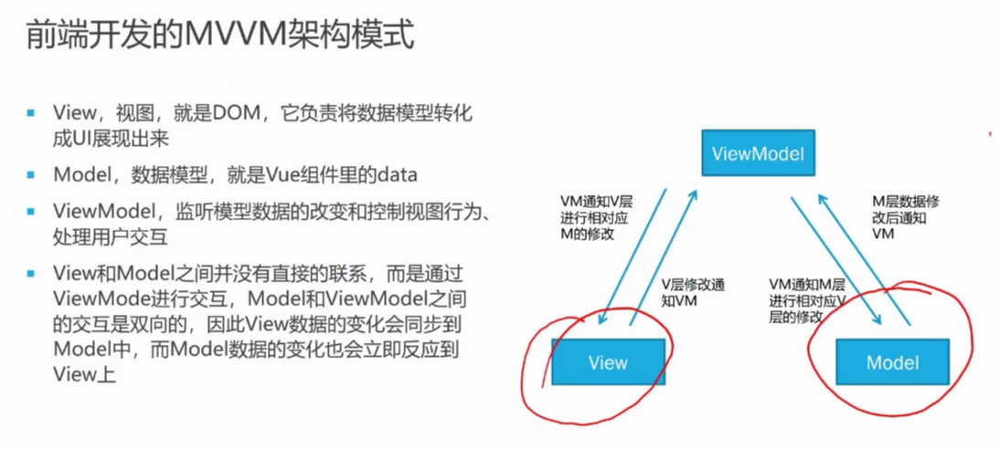

[toc]
# REST
## 1.前后端分离的开发模式

### 1.1一个前后端开发的例子


ingress相当于一个网关，将来自浏览器的请求路由到不同的容器服务

## 2.前端开发（非重点）



1. 单文件组件（.vue文件）：模板、逻辑和样式

## 3.curl工具
1. curl 是常用的命令行工具，用来请求 Web 服务器。它的名字就是客户端（client）的 URL 工具的意思。它的功能非常强大，命令行参数多达几十种。如果熟练的话，完全可以取代 Postman 这一类的图形界面工具。
2. 安装：https://curl.se/download.html
3. `-v`参看请求头部的信息
4. accept：请求头部的一个属性，指的是客户端向服务端请求的格式的类型
## 4.Rest原则
1.  Representational State Transfer，表现层状态转移
2. 资源（Resources），就是网络上的一个实体，标识：URI
3. 表现层（Representation）：json、xml、html、pdf、excel
    - 资源展示形式
4. 状态转移（State Transfer）：服务端--客户端
    - 资源从一端到另一端
5. HTTP协议的四个操作方式的动词：GET（获取）、POST（创建）、PUT（更新）、DELETE（删除）
    - CRUD：Create、Read、Update、Delete
6. 如果一个架构符合REST原则，就称它为RESTful架构
## 5.相关代码
### 5.1模块依赖关系

1. data模块——数据持久化
2. domain模块——领域对象
3. security模块——安全
4. web模块——与原来页面相关
5. api模块——rest api的实现
6. cloud将所有模块集成为一个project，它也是程序的入口
7. 如何集成
   - 将所依赖的模块放入该模块的pom文件中
   - 将所有的模块放在根目录下的pom文件中，maven会自动找出依赖关系
   - 不想要的模块可以去除
```xml
<!-- taco_cloud的pom.xml -->
<dependency>
	<groupId>sia</groupId>
	<artifactId>tacocloud-security</artifactId>
	<version>${tacocloud.version}</version>
</dependency>

<dependency>
	<groupId>sia</groupId>
	<artifactId>tacocloud-api</artifactId>
	<version>${tacocloud.version}</version>
</dependency>

<dependency>
	<groupId>sia</groupId>
	<artifactId>tacocloud-web</artifactId>
	<version>${tacocloud.version}</version>
</dependency>
```
### 5.2配置本地域名
1. windows
  - 修改`C:\Windows\System32\drivers\etc`的HOSTS的文本文件
  - 把ip地址和域名的对应关系写进去
2. Linux
  - 路径为`/etc/hosts`
### 5.3开发代码
```java
@RestController
@RequestMapping(path="/api/tacos",                      // <1>
                produces={"application/json"})
@CrossOrigin(origins="http://tacocloud:8080")        // <2>
public class TacoController {
  private TacoRepository tacoRepo;

  public TacoController(TacoRepository tacoRepo) {
    this.tacoRepo = tacoRepo;
  }

  @GetMapping(params="recent")
  public Iterable<Taco> recentTacos() {                 //<3>
    PageRequest page = PageRequest.of(
            0, 12, Sort.by("createdAt").descending());
    return tacoRepo.findAll(page).getContent();
  }

  @PostMapping(consumes="application/json")
  @ResponseStatus(HttpStatus.CREATED)
  public Taco postTaco(@RequestBody Taco taco) {
    return tacoRepo.save(taco);
  }

  @GetMapping("/{id}")
  public Optional<Taco> tacoById(@PathVariable("id") Long id) {
    return tacoRepo.findById(id);
  }
```
1. @RestController注解，将返回的对象转为json格式串返回到客户端而不是渲染页面
    - 相当于@Controller加上@ResponseBody注解
    - @ResponseBody也可以放在某个方法上
2. 如何从java对象转为json格式串
    - 添加web依赖时，spring默认使用第三方的jackson的包
3. RequestMapping的produces注解，表示只处理请求头部的accept为json的那些请求
    - 我只产出json格式的内容
4. @CrossOrigin注解
    - CORS，Cross Origin Resource Sharing
    - 跨域资源共享，使得浏览器能从对前端的访问转到对后端的访问
       - 前后端ip不同，所以要跨域
    - 浏览器访问后端时，请求头部会带着最初的域名，与origin内容对比后，判断是否允许访问
### 5.4消息转换器
1. 使用注解@ResponseBody或类级@RestController，作用：指定使用消息转换器
2. 没有model和视图，控制器产生数据，然后消息转换器转换数据之后的资源表述。
3. spring自动注册一些消息转换器（HttpMethodConverter），不过类路径下要有对应转换能力的库，如：Jackson Json processor、JAXB库
    - 默认加的web依赖带了第三方的包
```xml
<dependency>
	<groupId>org.springframework.boot</groupId>
	<artifactId>spring-boot-starter-web</artifactId>
</dependency>
```
4. 请求传入，@RequestBody以及HttpMethodConverter
    - 将json格式串转为java对象
```java
@PostMapping(consumes="application/json")
@ResponseStatus(HttpStatus.CREATED)
public Taco postTaco(@RequestBody Taco taco) {
    return tacoRepo.save(taco);
}
```
### 5.5状态码
1. 状态码：由 3 位数字组成，第一位标识响应的类型，常用的5大类状态码如下：
    - 1xx：表示服务器已接收了客户端的请求，客户端可以继续发送请求
    - 2xx：表示服务器已成功接收到请求并进行处理
    - 3xx：表示服务器要求客户端重定向
    - 4xx：表示客户端的请求有非法内容
      - 例如未授权用户
    - 5xx：标识服务器未能正常处理客户端的请求而出现意外错误
    - 201：服务端创建了一个新的资源
### 5.6参数
1. 查询参数：@GetMapping(params="recent")
    - http://tacocloud:8080/api/tacos?recent
    - 通过@RequestParam注解获得其值
2. 路径参数：@GetMapping("/{id}")
    - http://tacocloud:8080/api/tacos/id
    - 通过@PathVariable注解获得其值
3. 表单参数
4. 请求参数
    - @RequestBody，将请求体中的json格式串转为java对象
### 5.7其他请求
1. put请求
```java
@PutMapping(path="/{orderId}", consumes="application/json")
public TacoOrder putOrder(
                      @PathVariable("orderId") Long orderId,
                      @RequestBody TacoOrder order) {
  order.setId(orderId);
  return repo.save(order);
}
```
2. patch请求：部分更新
```java
@PatchMapping(path="/{orderId}", consumes="application/json")
public TacoOrder patchOrder(@PathVariable("orderId") Long orderId,
                        @RequestBody TacoOrder patch) {

  TacoOrder order = repo.findById(orderId).get();
  if (patch.getDeliveryName() != null) {
    order.setDeliveryName(patch.getDeliveryName());
  }
  if (patch.getDeliveryStreet() != null) {
    order.setDeliveryStreet(patch.getDeliveryStreet());
  }
  if (patch.getDeliveryCity() != null) {
    order.setDeliveryCity(patch.getDeliveryCity());
  }
  if (patch.getDeliveryState() != null) {
    order.setDeliveryState(patch.getDeliveryState());
  }
  if (patch.getDeliveryZip() != null) {
    order.setDeliveryZip(patch.getDeliveryZip());
  }
  if (patch.getCcNumber() != null) {
    order.setCcNumber(patch.getCcNumber());
  }
  if (patch.getCcExpiration() != null) {
    order.setCcExpiration(patch.getCcExpiration());
  }
  if (patch.getCcCVV() != null) {
    order.setCcCVV(patch.getCcCVV());
  }
  return repo.save(order);
}
```
3. delete请求
```java
@DeleteMapping("/{orderId}")
@ResponseStatus(HttpStatus.NO_CONTENT)
public void deleteOrder(@PathVariable("orderId") Long orderId) {
  try {
    repo.deleteById(orderId);
  } catch (EmptyResultDataAccessException e) {}
}
```
### 5.8接口设计
1. 使用标准HTTP动词：GET、PUT、POST、DELETE，映射到CRUD
2. 使用URI来传达意图
    - 不要用get_taco，因为请求中已经表达了get
    - 注意资源的单复数
3. 请求和响应使用JSON
    - JSON最常用
4. 使用HTTP状态码来传达结果
## 6.spring-boot-starter-data-rest依赖
1. 添加依赖
```xml
<dependency>
	<groupId>org.springframework.boot</groupId>
	<artifactId>spring-boot-starter-data-rest</artifactId>
</dependency>
```
1. 为领域对象自动实现rest api
2. spring HEATEOAS项目
    - 超媒体作为应用状态引擎（Hypermedia AsThe Engine Of Application State，HEATEOAS）
    - 消费这个API的客户端可以使用这些超链接作为指南，以便于导航API并执行后续的请求
    - 也会生成POST和PUT请求
      - 对数据的CRUD操作也会自动实现
3. 指定url前缀路径
```yml
spring:
  data:
    rest:
      base-path: /data-api
```
1. @RestResource(rel="tacos", path="tacos")
    - 指定资源单复数，默认资源的复数加的是es
## 7.客户端如何调用rest api
```java
public class TacoCloudClient {

  private RestTemplate rest; // 需要自己new
  private Traverson traverson;

  public TacoCloudClient(RestTemplate rest, Traverson traverson) {
    this.rest = rest;
    this.traverson = traverson;
  }
  public Ingredient getIngredientById(String ingredientId) {
    return rest.getForObject("http://tacocloud:8080/data-api/ingredients/{id}",
                             Ingredient.class, ingredientId);
  }
  // 转成Ingredient.class对象
  // ingredientId填充id的占位


  // 可以得到响应的头部等信息
  public Ingredient getIngredientById(String ingredientId) {
    ResponseEntity<Ingredient> responseEntity =
        rest.getForEntity("http://tacocloud:8080/ingredients/{id}",
            Ingredient.class, ingredientId);
    log.info("Fetched time: {}",
            responseEntity.getHeaders().getDate());
    return responseEntity.getBody();
  }

  public List<Ingredient> getAllIngredients() {
    return rest.exchange("http://tacocloud:8080/api/ingredients",
            HttpMethod.GET, null, new ParameterizedTypeReference<List<Ingredient>>() {})
        .getBody();
  }

  public Ingredient createIngredient(Ingredient ingredient) {
    return rest.postForObject("http://tacocloud:8080/data-api/ingredients",
        ingredient, Ingredient.class);
  }
}
```
## 8.使用Feign调用REST API(不考)
1. 依赖
```xml
<dependency>
	<groupId>org.springframework.cloud</groupId>
	<artifactId>spring-cloud-starter-feign</artifactId>
</dependency>
```
2. 调用远程接口就像调用本地对象一样
3. 代码
```java
@FeignClient("organizationservice")
public interface OrganizationFeignClient {
  @RequestMapping(
    method = RequestMethod.GET,
    value = "v1/organizations/{organizationId}",
    consumes = "application/json")
  Organization getOrganization(@PathVariable("organizationId") String organizationId)
}
```