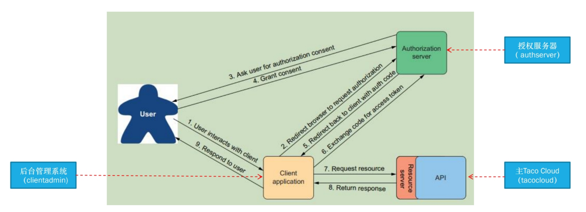

# 1.建立开发环境
1. 开发框架(Framework)是整个或部分系统的可重用设计，表现为一组抽象构件及构件实例间交互的方法；另一种定义认为，框架是可被应用开发者定制的应用骨架
2. Spring是Java生态圈的主流编程框架
    - 轻量级（Lightweight）
    - 非侵入性（No intrusive）
    - 容器（Container）
    - 依赖注入(Dependency Injection)
    - 面向切面编程(Aspect Oriented Programming)
    - 持久层（JDBC封装、事务管理、ORM工具整合）
    - Web框架（MVC、其它WEB框架整合）
    - 其他企业服务的封装
3. Spring Boot的特征有：
（1）可以创建独立的Spring应用程序，并且基于其Maven或Gradle插件，可以创建可执行的JARs和WARs
（2）内嵌Tomcat或Jetty等Servlet容器
（3）提供自动配置的“starter”项目对象模型（POMS）以简化Maven配置
（4）尽可能自动配置Spring容器
（5）提供准备好的特性，如指标、健康检查和外部化配置
（6）绝对没有代码生成，不需要XML配置
4. Spring Boot Devtools：开发期工具，runtime依赖，只在运行期起作用
    - 代码变更后自动重启应用
    - 面向浏览器资源发生变化时自动刷新浏览器（LiveReload端口）
    - 自动禁用模板缓存
    - 内置H2控制台：http://localhost:8080/h2-console
# 2.依赖注入（见博客）
1. DI（Dependency Injection）
    - 保留抽象接口，让组件（Component）依赖于抽象接口，当组件要与其他实际的对象发生依赖关系时，由抽象接口来注入依赖的实际对象
2. AOP（Aspect Oriented Programming）
    - 通过预编译方式和运行期间动态代理实现程序功能的统一维护的一种技术
    - 利用AOP可以对业务逻辑的各个部分进行隔离，从而使得业务逻辑各部分之间的耦合度降低，提高程序的可重用性，同时提高了开发效率
3. spring配置方案：告诉容器创建Bean，以及如何组装它们
    - 自动化配置：@Component、@Autowired
    - JavaConfig：@Configuration、@Bean
    - XML配置
    - 混合配置
# 3.面向切面编程
1. AOP（Aspect Oriented Programming）
2. 横切关注点：切入的代码的功能或者关注点，业务代码不关注这部分点
    - 日志
    - 安全
    - 事务
    - 缓存
3. 通知(Advice)：切面做什么？什么时候做？代表了切面的逻辑。
4. 切点(Pointcut)：指定通知存放的位置，定义要改的方法和参数。
5. 切面(Aspect)：通知 + 切点
6. 连接点：通知 + 切点的实例化：也就是和业务代码连接的地方
7. 引入(Introduction)：(给对象)引入新的行为和状态
8. 织入(weaving)：切面应用到目标对象的过程
9. 通知类型：@Before、@After、@AfterReturning、@AfterThrowing、@Around
## 3.1Spring AOP的两种支持类型
1. @AspectJ注解驱动的切面
2. @EnableAspectJAutoProxy //开启AspectJ的自动代理机制
3. 定义切面（@Aspect）
    - 加注解的普通POJO
    - 定义可重用的切点
    - Around通知
    - 定义参数（CD），测试
4. XML中声明切面
    - 前置和后置通知
    - <aop:pointcut>
    - 声明环绕通知
    - 传参数，测试
    - 引入新功能
# 4.Spring MVC
1. 分层结构
    - 控制层：Controller
    - 业务层：Service(业务逻辑)
    - 持久化层(DAO)：repository(数据库访问)
        - view层
        - model层
        - domain层(领域层)：把Java对象对应到数据库里的表
2. 请求经过Servlet后，他根据url与控制器的对应关系（handle mapping）把请求转到相应的控制器。控制器拿到请求和请求的参数，会转到业务层进行处理。业务层在数据处理的过程中可能做数据的持久化，把结果返回控制器层。控制器拿到数据后，把结果回退到Servlet上。Servlet拿到逻辑视图名，找到对应的视图解析器的第三方库，做视图的渲染，之后将渲染结果返回浏览器端。

3. 参数
    - 表单参数、路径参数和请求参数（查询参数）
    - json请求体
# 5.数据库访问
1. 关系型数据库访问的三种方式
    - 使用JdbcTemplate简化JDBC访问（spring-boot-starter-jdbc）
    - Spring Data JDBC（spring-boot-starter-data-jdbc）
    - Spring Data JPA（spring-boot-starter-data-jpa）
2. 区别
   - 第一种、第二种需要提供`schema.sql`脚本定义一些表结构
   - 第三种可以根据java对象自动生成表结构
   - 第二、第三种大多数情况不需要提供接口实现，只要提供接口
   - 从领域对象来看，第二、第三种要对领域对象加注解，提供和数据库表结构的对应关系
     - 第二种是spring实现的，加的是@Table
     - 第三种是jpa规范，加的是@Entity，包路径为`javax.persistence.*`
   - 第二、第三种都有@Query注解，但第三种更灵活，它有领域特定语言（DSL），基于方法的命名规则，表达意图
   - 第一种是数据库自动生成的id，要通过GeneratedKeyHolder的方式获取返回的id，再注入领域类。第二、第三种就不用操心id的值了
   - 依赖不同
3. 数据库初始化的三种方式
   - data.sql
   - CommandLineRunner接口
   - ApplicationRunner接口
# 6.Spring Data MongoDB、Redis
1. redis要序列化
    - 对象实现序列化接口
    - 指定序列化器
2. MongoDB：@Document
# 7.Spring Security

蓝色需要我们自己实现，绿色spring已经实现
1. 写注册控制器和注册页面将用户信息放入数据库
2. 使用Spring Data存储库来保存用户
3. 提供接口实现UserDetailService，用于从用户名获取用户信息
    - 用户类实现UserDetails接口
4. 提供密码转换器PasswordEncoder
5. 实现用户登录视图
    - 页面提交的表单要包含用户名和密码
6. 实现权限控制
    - SecurityFilterChain
    - @PreAuthorize
# 8.配置属性
1. 属性来源
    - 属性文件
    - 命令行参数
    - JVM系统属性
    - 操作系统环境变量
2. 如何激活profile
   1. 在配置文件中指定spring.profiles.active
   2. 环境变量：spring_profiles_active=profile名
   3. 命令行参数：java -jar ***.jar --spring.profiles.active=profile名
   4. JVM系统属性：java -Dspring.profiles.active=profile名 -jar ****.jar
   5. 使用注解@Profile条件化地创建Bean，可以加到@Configuration或@Bean上
# 9.Rest
1. rest原则
2. 消息转换器
3. 状态码
4. 接口设计
    - 使用标准HTTP动词
    - 使用URI传达意图
    - 请求和响应使用JSON
    - 使用HTTP状态码来传达结果
# 10.Oauth2(要看笔记)

过程

- 1. 用户使用客户端应用程序
- 2. 客户端发现用户未登录无法使用API，**重定向**到授权服务器
- 3. 授权服务器打开用户名对话框，索取用户名和密码
- 4. 授权服务器提供授权界面，让用户为客户端提供一些权限
- 5. 用户授权后，授权服务器为客户端返回授权码
- 6. 客户端使用code向授权服务器交换一个token
- 7. 客户端请求API时，头部会带上token（authorization属性）
- 8. 资源服务器向授权服务器请求公钥，确认token的合法性，将资源返回客户端（token中带有授权服务器的私钥）
- 9. 客户端将资源呈现给用户

**为什么要先拿到code，然后通过code去交换token？**

- 资源服务器要验证客户端的id和密码才能给token，只要code而没有密码是无法拿到token的
- 避免泄露**客户端的密码**

授权服务器和客户端为什么要重复定义客户端的重定向地址

- 授权服务器维护的重定向地址只是用来校验
# 11.消息中间件
1. 消息转换器：实现对象到消息的转化
    - 收发消息都需要消息转换器
2. 如果对象转为json格式，领域对象不需要实现序列化接口
3. 消息头、属性、消息体
# 12.Spring Integration
1. 集成流配置
    - XML配置
    - Java配置
    - 使用DSL的java配置
2. 集成流组件
    - 消息通道
    - 过滤器
    - 转换器
    - 路由器
    - 切分器（返回列表）
    - 服务激活器
    - 网关
3. 消息头（header）+消息体（payload）
# 13.反应式编程
1. 反应式编程解决什么问题
    - I/O密集型场景
    - 同步阻塞线程，阻塞线程多，CPU利用率不高，性能下降
    - 管理多线程，意味着更高的复杂性
2. 反应式规范对应四个接口：
   1. Publisher：消息的发布者
   2. Subscriber：消息的订阅者，消费数据
   3. Processor：处理数据，既是发布者，也是订阅者
   4. Subscription：相当于协调者，协调订阅者和消费者
3. map，同步
4. flatMap，异步
   - 将原来的流中的每个元素转换为一个新的流，然后再将这些流合并为一个流
   - 我们对每个流可以放在不同线程中并发处理
5. 三类消息
   - 反应式编程的消息可以认为是java的对象
   - spring integration里的消息包含消息体和消息头、属性
   - 消息中间件：有消息体和消息头，需要提供**消息转换器**（需要远程传输）
# 14.Spring WebFlux
1. 异步Web框架的轮询机制
    - 用更少的线程处理更多的请求，从而减少线程管理的开销
2. Spring MVC和Spring WebFlux的共性与不同

# 15.docker
1. 数据存储
    - volumes：Docker管理宿主机文件系统的一部分，默认位于 /var/lib/docker/volumes 目录中
    - bind mounts：意味着可以存储在宿主机系统的任意位置
    - tmpfs (temporary file system)：挂载存储在宿主机系统的内存中，而不会写入宿主机的文件系统
2. docker的三部分
   - docker daemon：运行在主机上的服务端程序，负责管理镜像、容器、网络和存储等组件。它响应来自Docker客户端的请求，并管理容器的创建、运行和停止等操作。
   - docker client：与Docker守护进程通信的命令行工具或API，允许用户通过命令行或其他接口与Docker守护进程交互
   - registry：镜像仓库，管理镜像
# 16.容器镜像的构建与编排
1. 如何编写最佳的dockerfile
   - .dockerignore文件
   - 容器只运行单个应用
   - 将多个RUN指令合并为一个
     - 有镜像分层
   - 基础镜像的标签不要用latest
     - latest具有可变性，不稳定
   - 每个RUN指令后删除多余文件
   - 选择合适的基础镜像(alpine版本最好，轻量级镜像)
   - 设置WORKDIR和CMD
   - 合理调整COPY和RUN的顺序
     - 变化少的在前
   - 使用ENTRYPOINT
2. 镜像分层--将所有的RUN指令合并为一个
   - Dockerfile中的每个指令都会创建一个新的镜像层
   - 镜像层将被缓存和复用
   - 当Dockerfile的指令修改了，复制的文件变化了，或者构建镜像时指定的变量不同了，对应的镜像层缓存就会失效
   - 某一层的镜像缓存失效之后，它之后的镜像层缓存都会失效
   - 镜像层是不可变的，如果我们在某一层中添加一个文件，然后在下一层中删除它，则镜像中依然会包含该文件(只是这个文件在Docker容器中不可见了)
3. docker-compose常用命令
# 17.k8s
1. 访问服务的方法
    - - kubectl port-forward ……
    - kubectl create ingress ……
    - kubectl run -i -t --rm=true mycurl --image=curlimages/curl:latest --restart=Never --command -- sh
       - 在shell中使用curl来进行服务（ip地址/服务名）的访问